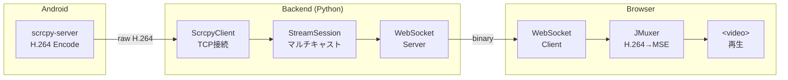

# AGENTS.md - AI コーディングエージェント向けガイド

このドキュメントは、GitHub Copilot、Claude、Cursor などの AI コーディングエージェントが本プロジェクトを理解し、適切にコードを生成・修正するための指示書です。

---

## クイックリファレンス

> **重要**: 作業開始前に必ず [README.md](./README.md) を確認してください。

| 項目 | 内容 |
|------|------|
| **プロジェクト名** | screen-stream-capture |
| **主要言語** | Python, TypeScript |
| **フレームワーク** | FastAPI, React |
| **パッケージマネージャー** | uv (Python), npm (Node.js) |
| **テストフレームワーク** | pytest, Jest |

---

## ⚠️ 作業前の必須確認事項

**作業を始める前に、以下のドキュメントを必ず確認すること：**

| ドキュメント | 確認するタイミング |
|-------------|-------------------|
| **[README.md](./README.md)** | プロジェクト全体の把握、セットアップ方法 |
| **[docs/architecture.md](./docs/architecture.md)** | アーキテクチャ詳細 |
| **[docs/api-reference.md](./docs/api-reference.md)** | API リファレンス |

**重要**: 一般的なフレームワークの知識だけで推測して作業しないこと。プロジェクト固有のルールや設定を必ず確認してください。

---

## プロジェクト概要

### 説明

Android デバイスの画面を Web ブラウザにリアルタイムでストリーミングするライブラリ。scrcpy-server を活用し、H.264 ビデオストリームを WebSocket 経由でブラウザに送信、JMuxer でデコードして表示します。

### アーキテクチャ



---

## ディレクトリ構造

```
screen-stream-capture/
├── AGENTS.md                      # 本ファイル（AI向けガイド）
├── README.md                      # プロジェクト概要
├── Makefile                       # ビルド・起動コマンド
├── docker-compose.yml             # Docker Compose 設定
├── packages/
│   ├── android-screen-stream/     # Python ライブラリ
│   │   ├── pyproject.toml
│   │   ├── README.md
│   │   └── src/android_screen_stream/
│   │       ├── __init__.py
│   │       ├── config.py          # StreamConfig
│   │       ├── client.py          # ScrcpyClient
│   │       └── session.py         # StreamSession, StreamManager
│   └── react-android-screen/      # React コンポーネント
│       ├── package.json
│       ├── README.md
│       └── src/
│           ├── index.ts
│           ├── H264Player.tsx
│           ├── useAndroidStream.ts
│           └── types.ts
├── examples/
│   └── simple-viewer/             # 使用例
│       ├── backend/
│       └── frontend/
├── vendor/                        # scrcpy-server.jar（make setup でダウンロード）
├── docs/                          # ドキュメント
│   ├── architecture.md
│   └── api-reference.md
└── work/                          # 一時的な設計書・計画書
```

---

## 開発ガイド

### セットアップ

```bash
# 初期セットアップ（scrcpy-server ダウンロード + Docker ビルド + 起動）
make setup

# Docker 起動
make up

# Docker 終了
make down

# 完全再構築
make rebuild
```

### 依存関係管理

```bash
# Python パッケージの追加（android-screen-stream）
cd packages/android-screen-stream
uv add <package-name>

# NPM パッケージの追加（react-android-screen）
cd packages/react-android-screen
npm install <package-name>
```

### Python 依存関係管理（uv 必須）

Python の依存関係管理には **必ず uv を使用すること**。

```bash
# ライブラリの追加
uv add <package-name>

# 開発用ライブラリの追加
uv add --dev <package-name>

# 依存関係の同期
uv sync

# Python スクリプトの実行
uv run python script.py

# pytest の実行
uv run pytest tests/ -v
```

#### ⚠️ 禁止事項

- `pip install` を直接使用しない
- `requirements.txt` を手動で編集しない
- `pyproject.toml` の dependencies を手動で編集しない（uv add が自動管理）

---

## コーディング規約

### 全般

- **型安全性**: 可能な限り型を明示的に定義する
- **ドキュメント**: 公開 API には必ず docstring/JSDoc を記述する
- **テスト**: 新機能や修正には必ずテストを追加する
- **コミット**: 1 つの論理的な変更につき 1 コミット
- **非同期処理**: async/await を活用し、ブロッキング処理を避ける
- **図表の記述**: アーキテクチャ図やフロー図は Mermaid 形式で記述する（ASCII アートは使用しない）

### 命名規則

| 種類 | 規則 | 例 |
|------|------|-----|
| 変数・関数 | snake_case (Python) / camelCase (TS) | `get_user_data`, `getUserData` |
| クラス | PascalCase | `StreamSession` |
| 定数 | UPPER_SNAKE_CASE | `MAX_RETRY_COUNT` |
| ファイル | snake_case (Python) / kebab-case (TS) | `stream_session.py`, `H264Player.tsx` |

### Python コードスタイル

```python
from android_screen_stream import StreamSession, StreamConfig

# 型ヒントを使用
async def start_stream(serial: str, config: StreamConfig | None = None) -> StreamSession:
    """ストリーミングセッションを開始する

    Args:
        serial: Android デバイスのシリアル番号
        config: ストリーミング設定（省略時はデフォルト）

    Returns:
        開始されたストリーミングセッション
    """
    session = StreamSession(serial, server_jar="vendor/scrcpy-server.jar", config=config)
    await session.start()
    return session
```

### TypeScript コードスタイル

```tsx
import { H264Player } from 'react-android-screen'

interface StreamViewerProps {
  serial: string
  className?: string
}

const StreamViewer: React.FC<StreamViewerProps> = ({ serial, className }) => {
  return (
    <H264Player
      wsUrl={`/api/ws/stream/${serial}`}
      className={className}
      onConnected={() => console.log('connected')}
    />
  )
}
```

---

## 禁止事項

以下の行為は **禁止** です：

1. **テストなしでコードを変更しない**
2. **ドキュメントを更新せずに API を変更しない**
3. **ハードコードされた値を使用しない**（環境変数または設定ファイルを使用）
4. **計画せずに大規模な変更を始めない**（`work/` に計画書を作成してから実行）

---

## ⚠️ Docker 環境での注意事項

### adb サーバーへのアクセス

Docker コンテナから adb サーバーにアクセスするには、ホストの adb サーバーを使用します：

```yaml
# docker-compose.yml
environment:
  - ADB_SERVER_SOCKET=tcp:host.docker.internal:5037
extra_hosts:
  - "host.docker.internal:host-gateway"
```

**前提条件**: ホストで `adb start-server` が実行されていること。

### ボリュームマウント

editable install のため、ソースコードをマウントしています：

```yaml
volumes:
  - ./packages/android-screen-stream:/app/packages/android-screen-stream:ro
  - ./vendor:/app/vendor:ro
```

---

## 開発ワークフロー

### 基本サイクル

```
1. 課題/タスクを確認
   └─ 何を実装するか明確にする

2. 関連コードを調査
   └─ packages/ 内のライブラリ構造を理解

3. 実装
   └─ 既存のコードスタイルに従う

4. テストを追加・実行
   └─ 全テストがパスすることを確認

5. コミット
   └─ 意味のあるコミットメッセージ
```

### 大規模な変更のワークフロー

1. **計画書を作成**
   - `work/<feature_name>/plan.md` に計画を記述
   - 目的、変更範囲、リスクを明記

2. **ユーザーの承認を得る**
   - 計画の確認前に実装を開始しない

3. **段階的に実装**
   - 1 ステップごとに動作確認
   - 小さなコミットを積み重ねる

4. **ドキュメントを更新**
   - 完了後、`docs/` に成果物の説明を追加

---

## テスト

### テストの実行

```bash
# Python テスト
cd packages/android-screen-stream
uv run pytest tests/ -v

# TypeScript テスト
cd packages/react-android-screen
npm test
```

---

## トラブルシューティング

### よくある問題

| 症状 | 原因 | 対処 |
|------|------|------|
| adb が接続できない | adb サーバー未起動 | `adb start-server` を実行 |
| Docker ビルドエラー | キャッシュの問題 | `make rebuild` |
| ストリームが表示されない | デバイス未接続 | `adb devices` で確認 |
| scrcpy-server.jar がない | ダウンロード未実行 | `make setup` |

### デバッグ手順

1. **ログを確認**: `make logs`
2. **adb 接続確認**: `adb devices`
3. **ポート確認**: `lsof -i :8000` / `lsof -i :5173`

---

## 環境変数

| 変数名 | 説明 | デフォルト値 |
|--------|------|-------------|
| `SCRCPY_SERVER_JAR` | scrcpy-server.jar のパス | `vendor/scrcpy-server.jar` |
| `ADB_SERVER_SOCKET` | adb サーバーのソケット | - |

---

## 参考リンク

### プロジェクト内ドキュメント

- [README.md](./README.md) - プロジェクト概要
- [docs/architecture.md](./docs/architecture.md) - アーキテクチャ詳細
- [docs/api-reference.md](./docs/api-reference.md) - API リファレンス
- [packages/android-screen-stream/README.md](./packages/android-screen-stream/README.md) - Python ライブラリ
- [packages/react-android-screen/README.md](./packages/react-android-screen/README.md) - React コンポーネント

### 外部ドキュメント

- [scrcpy](https://github.com/Genymobile/scrcpy) - Android 画面ミラーリング
- [JMuxer](https://github.com/nicwaller/jmuxer) - H.264 → MSE 変換
- [FastAPI](https://fastapi.tiangolo.com/) - Python Web フレームワーク
- [uv](https://docs.astral.sh/uv/) - Python パッケージマネージャー

---

## 更新履歴

| 日付 | 変更内容 |
|------|----------|
| 2026-01-25 | ライブラリ化に伴い全面改訂 |
