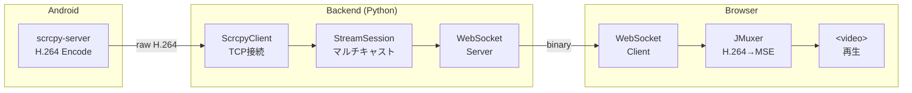

# screen-stream-capture

Android デバイスの画面をリアルタイムで Web ブラウザにストリーミングするライブラリ

## 特徴

- 🚀 **低遅延** H.264 ストリーミング
- 📱 **複数デバイス** 同時対応
- 🔧 **設定可能** 解像度・FPS・ビットレート
- 🐳 **Docker Compose** で簡単起動
- 📦 **ライブラリ提供** 他プロジェクトへ組み込み可能

## アーキテクチャ



## クイックスタート

### 前提条件

- Docker & Docker Compose
- Android デバイス（USB接続 or エミュレータ）
- adb（Android Debug Bridge）

### セットアップ

```bash
git clone https://github.com/aRaikoFunakami/screen-stream-capture.git
cd screen-stream-capture

# 初期セットアップ（scrcpy-server ダウンロード + Docker ビルド + 起動）
make setup
```

ブラウザで http://localhost:5173 にアクセス

### Docker なしでバックエンドのみ起動

Docker を使わずにバックエンドのみを起動する場合：

#### 前提条件

- Python 3.11+
- [uv](https://docs.astral.sh/uv/)（Python パッケージマネージャー）
- adb（Android Debug Bridge）がホストにインストール済み

#### セットアップ & 起動

```bash
# プロジェクトルートで実行
./backend/scripts/run_local.sh
```

または手動で実行する場合：

```bash
# 1. scrcpy-server をダウンロード
make download-scrcpy-server

# 2. バックエンドディレクトリに移動
cd backend

# 3. 依存関係をインストール（android-screen-stream を含む）
uv add --editable "$(pwd)/../packages/android-screen-stream"
uv sync

# 4. バックエンド起動
uv run uvicorn app.main:app --host 127.0.0.1 --port 8000 --reload
```

起動後、以下にアクセス：
- Swagger UI: http://localhost:8000/docs
- ヘルスチェック: http://localhost:8000/api/health

## フロントエンドの使い方

### メイン画面


1. **システム状態**: バックエンドの接続状態とバージョンを表示
2. **キャプチャ設定**: JPEG 品質（1-100）とサーバー保存オプション
3. **ストリーミング**: 接続中のデバイス一覧とリアルタイム映像

各デバイスカードには以下の情報が表示されます：
- デバイス名とシリアル番号
- エミュレータかどうかのラベル
- キャプチャ接続状態
- 受信データ量とチャンク数

### キャプチャ機能


**📷 キャプチャ** ボタンをクリックすると、現在の画面をスナップショットとして取得できます。

- キャプチャ画像はオーバーレイで表示
- **×** ボタンまたはオーバーレイ外クリックで閉じる
- 「サーバーにも保存」にチェックを入れると、サーバー側にも JPEG が保存される

### API ドキュメント

バックエンド API ドキュメント（FastAPI 自動生成）:

- Swagger UI: http://localhost:8000/docs
- ReDoc: http://localhost:8000/redoc
- OpenAPI JSON: [docs/openapi.json](docs/openapi.json)（サーバー起動不要）

OpenAPI スキーマを更新するには：

```bash
make openapi
```

### コマンド一覧

| コマンド | 説明 |
|---------|------|
| `make setup` | 初期セットアップ |
| `make up` | Docker 起動 |
| `make down` | Docker 終了 |
| `make rebuild` | 完全再構築 |
| `make logs` | ログ表示 |
| `make openapi` | OpenAPI スキーマ出力 |
| `make help` | ヘルプ表示 |

## ライブラリとして使う

### Python (Backend)

```bash
# editable install
uv add --editable /path/to/packages/android-screen-stream
```

```python
from android_screen_stream import StreamSession, StreamConfig

session = StreamSession(
    "emulator-5554",
    server_jar="vendor/scrcpy-server.jar",
    config=StreamConfig.balanced(),
)
await session.start()

# 購読（複数クライアント対応）
async for chunk in session.subscribe():
    await websocket.send_bytes(chunk)
```

詳細: [packages/android-screen-stream/README.md](packages/android-screen-stream/README.md)

### Python (Capture Client)

```bash
# editable install
uv add --editable /path/to/packages/android-capture-client
```

```python
from android_capture_client import CaptureSession

# バックグラウンドスレッドで WebSocket 接続を維持
with CaptureSession("emulator-5554", backend_url="ws://localhost:8000") as session:
    # 任意のタイミングでスクリーンショットを取得（メインスレッドはブロックされない）
    result = session.capture(quality=80)
    result.save("screenshot.jpg")
    print(f"Captured: {result.width}x{result.height}")
```

詳細: [packages/android-capture-client/README.md](packages/android-capture-client/README.md)

### React (Frontend)

```bash
npm install /path/to/packages/react-android-screen
```

```tsx
import { H264Player } from 'react-android-screen'

<H264Player
  wsUrl="/api/ws/stream/emulator-5554"
  className="w-full"
/>
```

詳細: [packages/react-android-screen/README.md](packages/react-android-screen/README.md)

## StreamConfig プリセット

| プリセット | 解像度 | FPS | ビットレート |
|-----------|--------|-----|-------------|
| `StreamConfig()` | 720p | 30 | 2Mbps |
| `StreamConfig.low_bandwidth()` | 720p | 15 | 1Mbps |
| `StreamConfig.balanced()` | 1080p | 30 | 4Mbps |
| `StreamConfig.high_quality()` | 1080p | 60 | 8Mbps |

## プロジェクト構成

```
screen-stream-capture/
├── backend/                        # 公式 Backend (FastAPI)
├── packages/
│   ├── android-screen-stream/     # Python ライブラリ（H.264 ストリーミング）
│   ├── android-capture-client/    # Python ライブラリ（スクリーンキャプチャ）
│   └── react-android-screen/      # React コンポーネント
├── examples/
│   └── simple-viewer/             # 使用例
│       └── frontend/              # フロントエンドサンプル
├── vendor/                         # scrcpy-server.jar (make setup でダウンロード)
├── docker-compose.yml
├── Makefile
└── README.md
```

## WebCodecs 利用時の注意（リモートアクセス）

WebCodecs API（低遅延プレイヤー）は **Secure Context** でのみ動作します。

| アクセス方法 | WebCodecs | MSE/JMuxer |
|-------------|-----------|------------|
| `http://localhost:5173` | ✅ 動作 | ✅ 動作 |
| `http://127.0.0.1:5173` | ✅ 動作 | ✅ 動作 |
| `http://192.168.x.x:5173`（HTTP + IP） | ❌ 動作しない | ✅ 動作 |
| `https://example.com` | ✅ 動作 | ✅ 動作 |

### リモートサーバーで WebCodecs を使う方法

#### 方法 1: SSH トンネル（推奨・証明書不要）

```bash
# ローカルマシンで実行（リモートサーバーへトンネル）
ssh -L 5173:localhost:5173 -L 5174:localhost:5174 -L 8000:localhost:8000 user@remote-server
```

その後、ブラウザで `http://localhost:5173` にアクセス。

#### 方法 2: Chrome フラグで例外許可（開発用）

1. Chrome で `chrome://flags/#unsafely-treat-insecure-origin-as-secure` を開く
2. `http://192.168.x.x:5173` を追加
3. Chrome を再起動

#### 方法 3: HTTPS を設定（本番向け）

Let's Encrypt 等で SSL 証明書を取得し、リバースプロキシ（nginx 等）で HTTPS を有効化。

> **補足**: MSE/JMuxer プレイヤーは HTTP + IP アドレスでも動作しますが、WebCodecs より遅延が大きくなります（50-150ms 程度）。

## ドキュメント

- [アーキテクチャ詳細](docs/architecture.md)
- [H.264 ストリーミング経路（scrcpy-server→Browser end-to-end）](docs/streaming-h264-end-to-end.md)
- [Backend API（FastAPI / OpenAPI）](docs/backend-openapi.md)
- [途中参加（late join）で白画面になる問題と解決策](docs/late-join.md)
- [画面回転（縦/横）に Web 表示を追従させるノウハウ](docs/screen-rotation.md)

## 技術スタック

- **scrcpy-server**: Android 画面キャプチャ & H.264 エンコード
- **Python / FastAPI**: バックエンド WebSocket サーバー
- **JMuxer**: ブラウザ内 H.264 → MSE 変換
- **React / TypeScript**: フロントエンド

## ライセンス

MIT

### サードパーティライセンス

- [scrcpy](https://github.com/Genymobile/scrcpy) - Apache License 2.0
- [JMuxer](https://github.com/nicwaller/jmuxer) - MIT License
