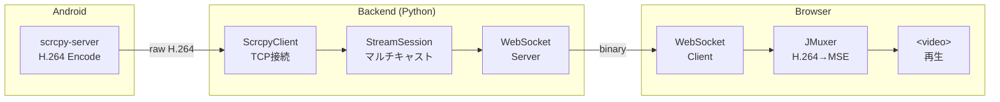
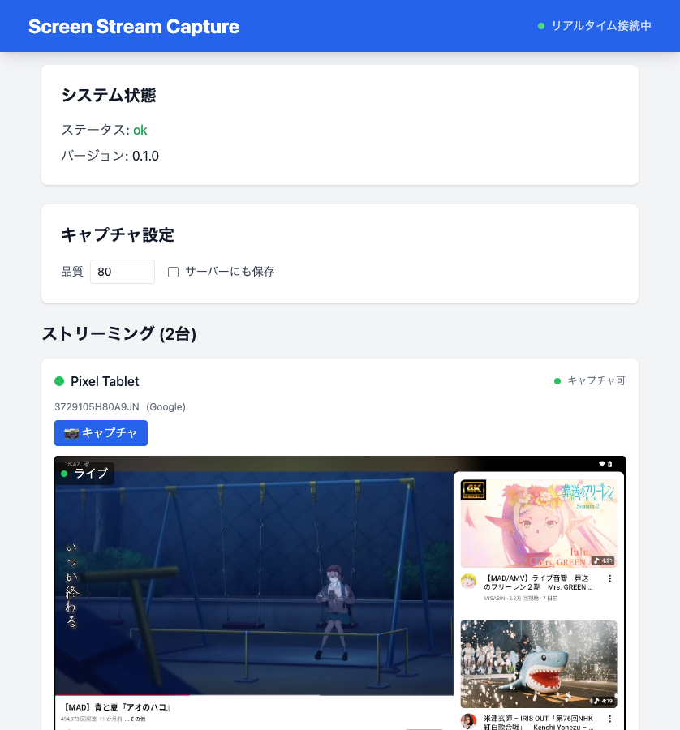
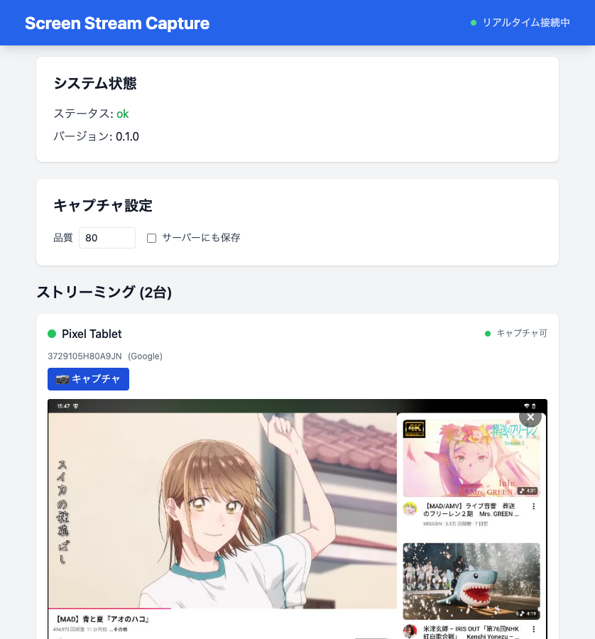

# screen-stream-capture

Android デバイスの画面をリアルタイムで Web ブラウザにストリーミングするライブラリ

## 特徴

- 🚀 **低遅延** H.264 ストリーミング
- 📱 **複数デバイス** 同時対応
- 🔧 **設定可能** 解像度・FPS・ビットレート
- 🐳 **Docker Compose** で簡単起動
- 📦 **ライブラリ提供** 他プロジェクトへ組み込み可能

## アーキテクチャ



## クイックスタート

### 前提条件

- Docker & Docker Compose
- Android デバイス（USB接続 or エミュレータ）
- adb（Android Debug Bridge）

### セットアップ

```bash
git clone https://github.com/your/screen-stream-capture.git
cd screen-stream-capture

# 初期セットアップ（scrcpy-server ダウンロード + Docker ビルド + 起動）
make setup
```

ブラウザで http://localhost:5173 にアクセス

## フロントエンドの使い方

### メイン画面



1. **システム状態**: バックエンドの接続状態とバージョンを表示
2. **キャプチャ設定**: JPEG 品質（1-100）とサーバー保存オプション
3. **ストリーミング**: 接続中のデバイス一覧とリアルタイム映像

各デバイスカードには以下の情報が表示されます：
- デバイス名とシリアル番号
- エミュレータかどうかのラベル
- キャプチャ接続状態
- 受信データ量とチャンク数

### キャプチャ機能



**📷 キャプチャ** ボタンをクリックすると、現在の画面をスナップショットとして取得できます。

- キャプチャ画像はオーバーレイで表示
- **×** ボタンまたはオーバーレイ外クリックで閉じる
- 「サーバーにも保存」にチェックを入れると、サーバー側にも JPEG が保存される

### API ドキュメント

バックエンド API ドキュメント（FastAPI 自動生成）:

- Swagger UI: http://localhost:8000/docs
- ReDoc: http://localhost:8000/redoc
- OpenAPI: http://localhost:8000/openapi.json

### コマンド一覧

| コマンド | 説明 |
|---------|------|
| `make setup` | 初期セットアップ |
| `make up` | Docker 起動 |
| `make down` | Docker 終了 |
| `make rebuild` | 完全再構築 |
| `make logs` | ログ表示 |
| `make help` | ヘルプ表示 |

## ライブラリとして使う

### Python (Backend)

```bash
# editable install
uv add --editable /path/to/packages/android-screen-stream
```

```python
from android_screen_stream import StreamSession, StreamConfig

session = StreamSession(
    "emulator-5554",
    server_jar="vendor/scrcpy-server.jar",
    config=StreamConfig.balanced(),
)
await session.start()

# 購読（複数クライアント対応）
async for chunk in session.subscribe():
    await websocket.send_bytes(chunk)
```

詳細: [packages/android-screen-stream/README.md](packages/android-screen-stream/README.md)

### React (Frontend)

```bash
npm install /path/to/packages/react-android-screen
```

```tsx
import { H264Player } from 'react-android-screen'

<H264Player
  wsUrl="/api/ws/stream/emulator-5554"
  className="w-full"
/>
```

詳細: [packages/react-android-screen/README.md](packages/react-android-screen/README.md)

## StreamConfig プリセット

| プリセット | 解像度 | FPS | ビットレート |
|-----------|--------|-----|-------------|
| `StreamConfig()` | 720p | 30 | 2Mbps |
| `StreamConfig.low_bandwidth()` | 720p | 15 | 1Mbps |
| `StreamConfig.balanced()` | 1080p | 30 | 4Mbps |
| `StreamConfig.high_quality()` | 1080p | 60 | 8Mbps |

## プロジェクト構成

```
screen-stream-capture/
├── backend/                        # 公式 Backend (FastAPI)
├── packages/
│   ├── android-screen-stream/     # Python ライブラリ
│   └── react-android-screen/      # React コンポーネント
├── examples/
│   └── simple-viewer/             # 使用例
│       └── frontend/              # フロントエンドサンプル
├── vendor/                         # scrcpy-server.jar (make setup でダウンロード)
├── docker-compose.yml
├── Makefile
└── README.md
```

## ドキュメント

- [アーキテクチャ詳細](docs/architecture.md)
- [API リファレンス](docs/api-reference.md)
- [Backend API（FastAPI / OpenAPI）](docs/backend-openapi.md)
- [途中参加（late join）で白画面になる問題と解決策](docs/late-join.md)
- [Python ライブラリ](packages/android-screen-stream/README.md)
- [React コンポーネント](packages/react-android-screen/README.md)

## 技術スタック

- **scrcpy-server**: Android 画面キャプチャ & H.264 エンコード
- **Python / FastAPI**: バックエンド WebSocket サーバー
- **JMuxer**: ブラウザ内 H.264 → MSE 変換
- **React / TypeScript**: フロントエンド

## ライセンス

MIT

### サードパーティライセンス

- [scrcpy](https://github.com/Genymobile/scrcpy) - Apache License 2.0
- [JMuxer](https://github.com/nicwaller/jmuxer) - MIT License
