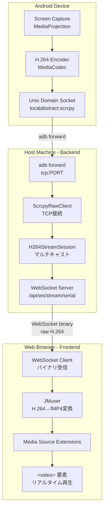
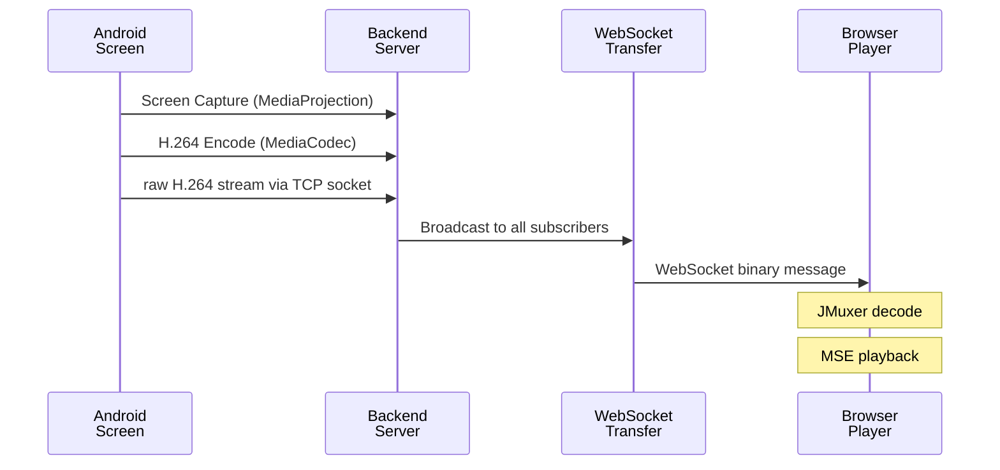

# Screen Stream Capture アーキテクチャ

## 概要

Screen Stream Captureは、Androidデバイスの画面をWebブラウザにリアルタイムでストリーミングするシステムです。scrcpy-serverを活用し、H.264ビデオストリームをWebSocket経由でブラウザに送信、JMuxerでデコードして表示します。

---

## システム構成図



---

## データフロー



---

## コンポーネント詳細

### 1. scrcpy-server（Androidデバイス上）

scrcpy-serverはAndroidデバイス上で動作するJavaアプリケーションで、画面をキャプチャしてH.264にエンコードします。

**起動コマンド:**
```bash
adb shell CLASSPATH=/data/local/tmp/scrcpy-server.jar \
    app_process / com.genymobile.scrcpy.Server 3.3.4 \
    tunnel_forward=true \
    audio=false \
    control=false \
    raw_stream=true \
    max_size=720 \
    max_fps=30
```

**主要オプション:**
| オプション | 説明 |
|-----------|------|
| `tunnel_forward=true` | adb forwardを使用してTCP接続 |
| `raw_stream=true` | メタデータなしの純粋なH.264出力 |
| `max_size=720` | 最大解像度（幅または高さ） |
| `max_fps=30` | 最大フレームレート |
| `audio=false` | 音声無効 |
| `control=false` | リモート操作無効 |

### 2. ScrcpyRawClient（バックエンド）

scrcpy-serverに直接TCP接続してraw H.264ストリームを取得するPythonクライアント。

**ファイル:** [backend/scrcpy_client.py](../backend/scrcpy_client.py)

```python
class ScrcpyRawClient:
    """scrcpy-serverに直接接続してraw H.264ストリームを取得"""
    
    async def start(self) -> None:
        """サーバー起動 → adb forward設定 → TCP接続"""
        await self._push_server()      # jarをデバイスにプッシュ
        await self._setup_tunnel()     # adb forward設定
        await self._start_server()     # scrcpy-server起動
        await self._connect()          # TCP接続
    
    async def stream(self) -> AsyncIterator[bytes]:
        """raw H.264チャンクを非同期で読み取り"""
        while self._running:
            chunk = await self._reader.read(65536)
            yield chunk
```

**接続フロー:**
```
1. adb forward tcp:PORT localabstract:scrcpy
2. adb shell ... scrcpy-server ...
3. asyncio.open_connection("localhost", PORT)
4. async for chunk in reader: yield chunk
```

### 3. H264StreamSession（バックエンド）

デバイスごとのストリーミングセッションを管理し、複数のWebSocketクライアントにマルチキャスト。

**ファイル:** [backend/h264_stream_session.py](../backend/h264_stream_session.py)

```python
class H264StreamSession:
    """デバイスごとのH.264ストリーミングセッション"""
    
    def __init__(self, serial: str):
        self._client: ScrcpyRawClient  # scrcpyクライアント
        self._subscribers: list[Queue] # 購読者のキュー
    
    async def subscribe(self) -> AsyncIterator[bytes]:
        """新規購読者としてストリームを受信"""
        queue = Queue()
        self._subscribers.append(queue)
        while True:
            chunk = await queue.get()
            yield chunk
    
    async def _run_broadcast(self):
        """全購読者にH.264データをブロードキャスト"""
        async for chunk in self._client.stream():
            for queue in self._subscribers:
                queue.put_nowait(chunk)
```

### 4. WebSocketエンドポイント（バックエンド）

**ファイル:** [backend/main.py](../backend/main.py)

```python
@app.websocket("/api/ws/stream/{serial}")
async def websocket_stream(websocket: WebSocket, serial: str):
    """WebSocket経由でraw H.264ストリームを送信"""
    await websocket.accept()
    
    session = await h264_manager.get_or_create(serial)
    
    async for chunk in session.subscribe():
        await websocket.send_bytes(chunk)
```

### 5. H264Player（フロントエンド）

JMuxerを使用してH.264ストリームをブラウザで再生するReactコンポーネント。

**ファイル:** [frontend/src/components/H264Player.tsx](../frontend/src/components/H264Player.tsx)

```typescript
function H264Player({ serial }: { serial: string }) {
  const videoRef = useRef<HTMLVideoElement>(null)
  const jmuxerRef = useRef<JMuxer>(null)
  
  useEffect(() => {
    // JMuxer初期化
    const jmuxer = new JMuxer({
      node: videoRef.current,
      mode: 'video',
      fps: 30,
    })
    
    // WebSocket接続
    const ws = new WebSocket(`ws://${host}/api/ws/stream/${serial}`)
    ws.binaryType = 'arraybuffer'
    
    ws.onmessage = (event) => {
      // H.264データをJMuxerに送信
      jmuxer.feed({ video: new Uint8Array(event.data) })
    }
  }, [serial])
  
  return <video ref={videoRef} autoPlay muted />
}
```

---

## 技術選定の理由

### なぜFFmpegによるfMP4変換を採用しなかったか

当初はFFmpegでH.264→fMP4変換を検討しましたが、以下の問題により断念：

1. **キーフレーム依存の遅延**
   - `frag_keyframe`オプションはキーフレームごとにのみフラグメントを出力
   - scrcpy-serverのキーフレーム間隔が長い（10秒以上）
   - リアルタイムストリーミングには不適

2. **バッファリングの問題**
   - FFmpegのH.264パーサーは入力のバッファリングが必要
   - 最初のフラグメント出力まで数秒の遅延

### なぜJMuxerを採用したか

1. **クライアントサイド変換**
   - サーバー負荷なし
   - 変換遅延が最小限

2. **H.264直接対応**
   - raw H.264（Annex B形式）を直接デコード
   - fMP4への変換をブラウザ側で実行

3. **Media Source Extensions (MSE)対応**
   - 標準的なブラウザAPIを使用
   - `<video>`要素での再生が可能

---

## パフォーマンス特性

### 測定結果

| 指標 | 値 |
|------|-----|
| 解像度 | 720×448 (Pixel Tablet) |
| フレームレート | 30 fps |
| ビットレート | ~200 kbps |
| 遅延 | <500ms |
| データ転送量 | ~600 KB / 10秒 |

### 最適化ポイント

1. **チャンクサイズ**: 65536バイトで効率的な転送
2. **キューサイズ**: 100チャンクで遅延クライアント対応
3. **自動停止**: 購読者がいなくなると5秒後にセッション終了

---

## ファイル構成

```
backend/
├── main.py                 # FastAPIアプリケーション、WebSocketエンドポイント
├── scrcpy_client.py        # scrcpy-server接続クライアント
├── h264_stream_session.py  # ストリームセッション管理
├── device_manager.py       # デバイス検出・管理
├── device_monitor.py       # adb track-devices監視
└── sse_manager.py          # SSEブロードキャスト

frontend/
├── src/
│   ├── App.tsx             # メインアプリケーション
│   └── components/
│       ├── H264Player.tsx  # JMuxerベースのプレイヤー
│       └── VideoPlayer.tsx # 旧fMP4プレイヤー（未使用）
└── package.json            # jmuxer依存関係

scrcpy/
└── scrcpy-server-v3.3.4    # scrcpy-serverのJARファイル
```

---

## 起動方法

### バックエンド
```bash
cd backend
uv run uvicorn main:app --host 0.0.0.0 --port 8000
```

### フロントエンド
```bash
cd frontend
npm run dev
```

### アクセス
```
http://localhost:5173/
```

---

## 今後の拡張可能性

1. **音声ストリーミング**: `audio=true`でオーディオ追加
2. **リモート操作**: `control=true`でタッチ/キー入力
3. **録画機能**: ストリームをサーバー側で保存
4. **複数デバイス同時表示**: グリッドレイアウト
5. **品質調整**: ビットレート・解像度の動的変更
