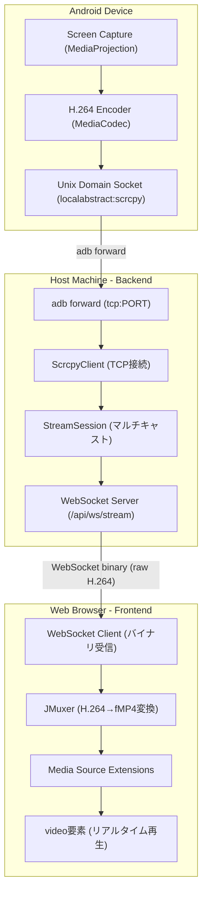
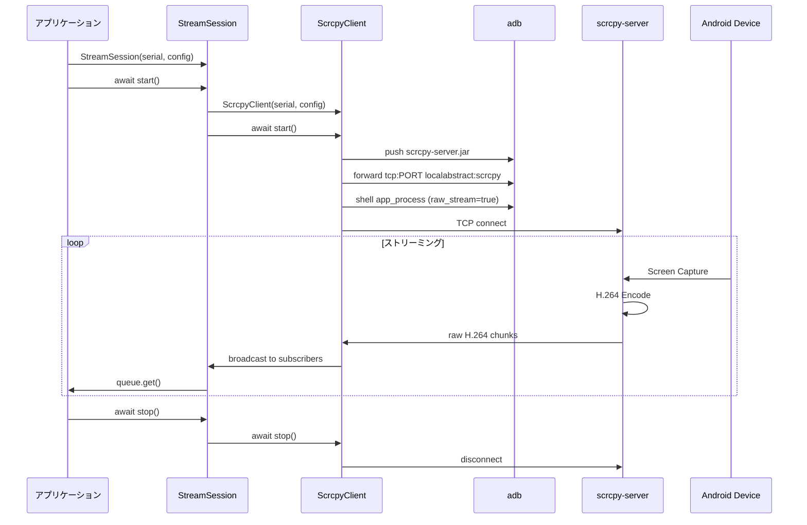
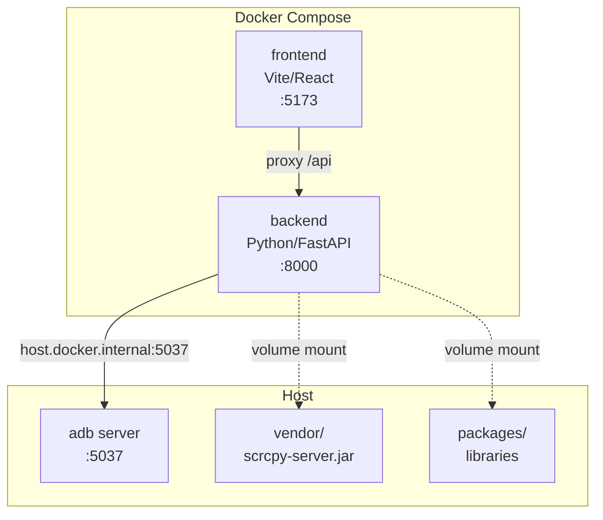

# Screen Stream Capture アーキテクチャ

## 概要

screen-stream-capture は、Android デバイスの画面を Web ブラウザにリアルタイムでストリーミングするライブラリです。scrcpy-server を活用し、H.264 ビデオストリームを WebSocket 経由でブラウザに送信、JMuxer でデコードして表示します。

---

## システム構成図



---

## データフロー



---

## 実装追跡（詳細）

アーキテクチャ概要の“実装上の接続点”を、Backend / android-screen-stream / react-android-screen / サンプルフロントまで含めて end-to-end で追跡した詳細は以下を参照してください。

- [scrcpy-server → Browser (JMuxer/MSE) までの H.264 ストリーミング経路（end-to-end）](streaming-h264-end-to-end.md)
```

---

## コンポーネント詳細

### 1. scrcpy-server（Android デバイス上）

scrcpy-server は Android デバイス上で動作する Java アプリケーションで、画面をキャプチャして H.264 にエンコードします。

**起動コマンド:**
```bash
adb shell CLASSPATH=/data/local/tmp/scrcpy-server.jar \
    app_process / com.genymobile.scrcpy.Server 3.3.4 \
    tunnel_forward=true \
    audio=false \
    control=false \
    raw_stream=true \
    max_size=720 \
    max_fps=30
```

**主要オプション:**
| オプション | 説明 |
|-----------|------|
| `tunnel_forward=true` | adb forward を使用して TCP 接続 |
| `raw_stream=true` | メタデータなしの純粋な H.264 出力 |
| `max_size=720` | 最大解像度（幅または高さ） |
| `max_fps=30` | 最大フレームレート |
| `audio=false` | 音声無効 |
| `control=false` | リモート操作無効 |

### 2. ScrcpyClient（Python ライブラリ）

scrcpy-server に直接 TCP 接続して raw H.264 ストリームを取得する Python クライアント。

**パッケージ:** `packages/android-screen-stream`

```python
from android_screen_stream import ScrcpyClient, StreamConfig

async with ScrcpyClient(
    serial="emulator-5554",
    server_jar="vendor/scrcpy-server.jar",
    config=StreamConfig.balanced(),
) as client:
    async for chunk in client.stream():
        process(chunk)
```

**接続フロー:**
```
1. adb push scrcpy-server.jar /data/local/tmp/
2. adb forward tcp:PORT localabstract:scrcpy
3. adb shell ... scrcpy-server ...
4. asyncio.open_connection("localhost", PORT)
5. async for chunk in reader: yield chunk
```

### 3. StreamSession（Python ライブラリ）

デバイスごとのストリーミングセッションを管理し、複数の WebSocket クライアントにマルチキャスト。

```python
from android_screen_stream import StreamSession, StreamConfig

session = StreamSession(
    serial="emulator-5554",
    server_jar="vendor/scrcpy-server.jar",
    config=StreamConfig.balanced(),
)
await session.start()

# 購読（複数クライアント対応）
async for chunk in session.subscribe():
    await websocket.send_bytes(chunk)

# 設定の動的変更
await session.update_config(StreamConfig.high_quality())
```

---

## 途中参加（late join）と白画面問題

このプロジェクトは `raw_stream=true` の raw H.264 (Annex B) を WebSocket で配信し、
ブラウザ側で JMuxer が fMP4(MSE) を生成します。

この方式は低遅延ですが、途中参加したクライアントが **SPS/PPS + IDR** を揃えられないと、
「接続できてバイト数も増えるのに白画面」という症状が起きます。

詳細（原因・対策・実装・図）:

- [途中参加（late join）で白画面になる問題と解決策](late-join.md)

### 4. StreamManager（Python ライブラリ）

複数デバイスのセッション管理。

```python
from android_screen_stream import StreamManager, StreamConfig

manager = StreamManager(
    server_jar="vendor/scrcpy-server.jar",
    default_config=StreamConfig.balanced(),
)

# セッションを取得または作成
session = await manager.get_or_create("emulator-5554")
```

### 5. H264Player（React コンポーネント）

JMuxer を使用して H.264 ストリームをブラウザで再生する React コンポーネント。

**パッケージ:** `packages/react-android-screen`

```tsx
import { H264Player } from 'react-android-screen'

<H264Player
  wsUrl="/api/ws/stream/emulator-5554"
  className="w-full max-w-2xl"
  onConnected={() => console.log('connected')}
  onError={(error) => console.error(error)}
/>
```

### 6. useAndroidStream（React フック）

カスタム UI を構築するための低レベルフック。

```tsx
import { useAndroidStream } from 'react-android-screen'

const { videoRef, status, stats, connect, disconnect } = useAndroidStream({
  wsUrl: '/api/ws/stream/emulator-5554',
  autoConnect: true,
})

return <video ref={videoRef} autoPlay muted />
```

### 7. JPEG Capture（Backend / WebSocket）

動画視聴とは別に、サーバー側で任意タイミングのJPEGキャプチャを取得できます。

- エンドポイント: `WS /api/ws/capture/{serial}`
- 方式: **WS 接続中だけ** FFmpeg を起動して H.264 を復号し、最新フレーム（latest-only）を保持
- `capture` 要求時: 最新フレームを JPEG にエンコードし、**JPEGバイナリ**を返却（必要ならサーバーにも保存）

プロトコル（最小）:

- client → server (text JSON): `{"type":"capture","format":"jpeg","quality":80,"save":true}`
- server → client (text JSON): `{"type":"capture_result",...}`
- server → client (binary): JPEG bytes

ポイント:

- デバイスごとにキャプチャ用デコーダは1つ（複数クライアントで共有）
- JPEGエンコードは要求時のみ（配信（stream WS）経路をブロックしない）

---

## 技術選定の理由

### なぜ FFmpeg による fMP4 変換を採用しなかったか

当初は FFmpeg で H.264→fMP4 変換を検討しましたが、以下の問題により断念：

1. **キーフレーム依存の遅延**
   - `frag_keyframe` オプションはキーフレームごとにのみフラグメントを出力
   - scrcpy-server のキーフレーム間隔が長い（10秒以上）
   - リアルタイムストリーミングには不適

2. **バッファリングの問題**
   - FFmpeg の H.264 パーサーは入力のバッファリングが必要
   - 最初のフラグメント出力まで数秒の遅延

### なぜ JMuxer を採用したか

1. **クライアントサイド変換**
   - サーバー負荷なし
   - 変換遅延が最小限

2. **H.264 直接対応**
   - raw H.264（Annex B 形式）を直接デコード
   - fMP4 への変換をブラウザ側で実行

3. **Media Source Extensions (MSE) 対応**
   - 標準的なブラウザ API を使用
   - `<video>` 要素での再生が可能

---

## パフォーマンス特性

### 測定結果

| 指標 | 値 |
|------|-----|
| 解像度 | 720×448 (Pixel Tablet) |
| フレームレート | 30 fps |
| ビットレート | ~200 kbps |
| 遅延 | <500ms |
| データ転送量 | ~600 KB / 10秒 |

### StreamConfig プリセット

| プリセット | 解像度 | FPS | ビットレート |
|-----------|--------|-----|-------------|
| `StreamConfig()` | 720p | 30 | 2Mbps |
| `StreamConfig.low_bandwidth()` | 720p | 15 | 1Mbps |
| `StreamConfig.balanced()` | 1080p | 30 | 4Mbps |
| `StreamConfig.high_quality()` | 1080p | 60 | 8Mbps |

---

## プロジェクト構成

```
screen-stream-capture/
├── packages/
│   ├── android-screen-stream/     # Python ライブラリ
│   │   ├── pyproject.toml
│   │   ├── README.md
│   │   └── src/
│   │       └── android_screen_stream/
│   │           ├── __init__.py
│   │           ├── config.py      # StreamConfig
│   │           ├── client.py      # ScrcpyClient
│   │           └── session.py     # StreamSession, StreamManager
│   │
│   └── react-android-screen/      # React コンポーネント
│       ├── package.json
│       ├── README.md
│       └── src/
│           ├── index.ts
│           ├── H264Player.tsx
│           ├── useAndroidStream.ts
│           └── types.ts
│
├── examples/
│   └── simple-viewer/             # 使用例
│       ├── backend/
│       │   ├── Dockerfile
│       │   ├── pyproject.toml
│       │   └── main.py
│       └── frontend/
│           ├── Dockerfile
│           ├── package.json
│           └── src/App.tsx
│
├── vendor/                        # 外部依存（make setup でダウンロード）
│   └── scrcpy-server.jar
│
├── docker-compose.yml
├── Makefile
├── docs/
│   ├── architecture.md            # 本ドキュメント
│   ├── backend-openapi.md         # Backend API（FastAPI / OpenAPI）
│   └── late-join.md               # 途中参加で白画面になる問題と解決策
│   └── streaming-h264-end-to-end.md # 実装追跡（end-to-end）
└── README.md
```

---

## Docker 構成



---

## 起動方法

### Docker Compose（推奨）

```bash
# 初期セットアップ
make setup

# アクセス
# http://localhost:5173/
```

### ローカル開発

```bash
# バックエンド
cd backend
uv run uvicorn app.main:app --host 0.0.0.0 --port 8000

# フロントエンド
cd examples/simple-viewer/frontend
npm run dev
```

---

## 今後の拡張可能性

1. **音声ストリーミング**: `audio=true` でオーディオ追加
2. **リモート操作**: `control=true` でタッチ/キー入力
3. **録画機能**: ストリームをサーバー側で保存
4. **複数デバイス同時表示**: グリッドレイアウト
5. **品質調整**: ビットレート・解像度の動的変更（`update_config()` で対応済み）
