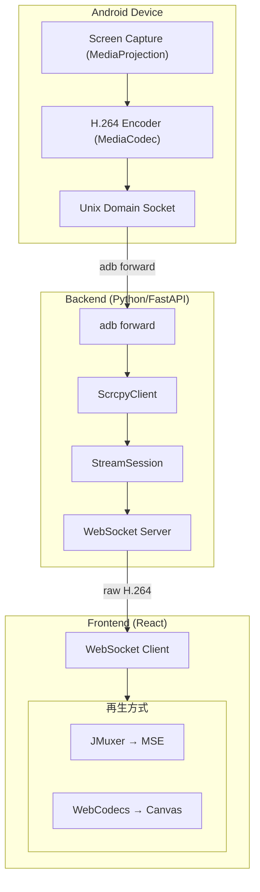
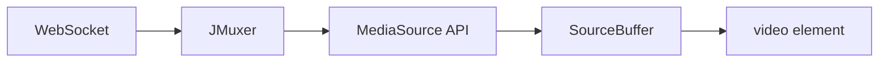
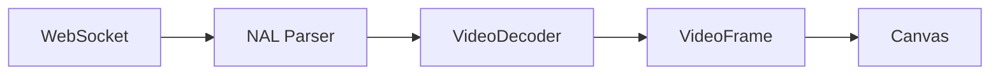
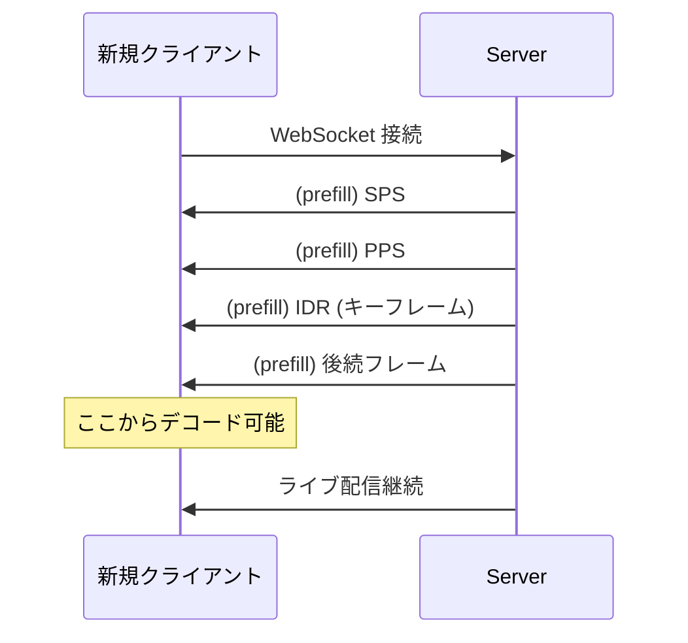

# Android 画面をウェブブラウザに超低遅延でリアルタイムストリーミングする：MSE vs WebCodecs 徹底比較

## はじめに

Android デバイスの画面を Web ブラウザにリアルタイム表示したい場面は多々あります。デバイステスト、リモート操作、ライブデモ、録画など。

本記事では、scrcpy-server を活用して H.264 ストリームを WebSocket で配信し、ブラウザ側で再生するシステムを構築した際に得た知見を共有します。特に、**MSE/JMuxer** と **WebCodecs** という2つの再生方式の違いと、それぞれの実装上のハマりポイントについて詳しく解説します。

> 注: 本記事中の遅延・性能に関する記述は「なぜ差が出るか」を説明するための目安です。
> 実測値はデバイス、解像度/fps、ネットワーク、ブラウザ実装によって大きく変わるため、最終判断は手元の環境で計測してください。

## システムアーキテクチャ

まず全体像を把握しましょう。



### データの流れ

1. **Android**: MediaProjection で画面をキャプチャ → MediaCodec で H.264 エンコード
2. **Backend**: adb forward 経由で TCP 接続 → raw H.264 を WebSocket で配信
3. **Frontend**: WebSocket でバイナリ受信 → **MSE** または **WebCodecs** で再生

## scrcpy-server について

[scrcpy](https://github.com/Genymobile/scrcpy) は Android 画面ミラーリングの定番ツールです。本プロジェクトでは scrcpy-server（Android 側で動作する Java アプリ）を活用しています。

### 起動コマンド

```bash
adb shell CLASSPATH=/data/local/tmp/scrcpy-server.jar \
    app_process / com.genymobile.scrcpy.Server 3.3.4 \
    tunnel_forward=true \
    audio=false \
    control=false \
    raw_stream=true \
    max_size=720 \
    max_fps=30
```

重要なオプション：

| オプション | 説明 |
|-----------|------|
| `tunnel_forward=true` | adb forward を使用（TCP 接続） |
| `raw_stream=true` | メタデータなしの純粋な H.264 出力 |
| `max_size=720` | 最大解像度（幅または高さ） |
| `max_fps=30` | 最大フレームレート |

`raw_stream=true` がポイントです。これにより scrcpy 固有のプロトコルを使わず、純粋な H.264 Annex-B ストリームを取得できます。

> 注: scrcpy-server のバージョンや利用可能なフラグは scrcpy 本体のバージョンに依存します。上記は一例として捉え、実運用では対象バージョンに合わせて調整してください。

## Backend 実装

Python + FastAPI で WebSocket サーバーを構築しています。

### ScrcpyClient

scrcpy-server に直接 TCP 接続して raw H.264 を取得します。

> 注: 以下は概念を説明するための簡略化した擬似コードです。実際の実装は backend/ や packages/ 配下を参照してください。

```python
class ScrcpyClient:
    async def start(self):
        # 1. scrcpy-server.jar を push
        await self._push_server()
        # 2. adb forward で TCP ポートを確保
        await self._setup_forward()
        # 3. scrcpy-server を起動
        self._server_proc = await self._start_server()
        # 4. TCP 接続
        self._reader, self._writer = await asyncio.open_connection(
            "localhost", self._port
        )

    async def stream(self) -> AsyncIterator[bytes]:
        while True:
            chunk = await self._reader.read(65536)
            if not chunk:
                break
            yield chunk
```

### StreamSession（マルチキャスト）

複数のクライアントが同じデバイスを視聴する場合、1つの scrcpy 接続を共有します。

> 注: 以下は概念を説明するための簡略化した擬似コードです。

```python
class StreamSession:
    def __init__(self, serial: str):
        self._subscribers: list[asyncio.Queue] = []
    
    async def subscribe(self) -> AsyncIterator[bytes]:
        queue = asyncio.Queue()
        self._subscribers.append(queue)
        try:
            while True:
                chunk = await queue.get()
                yield chunk
        finally:
            self._subscribers.remove(queue)
    
    async def _broadcast(self, chunk: bytes):
        for queue in self._subscribers:
            await queue.put(chunk)
```

### WebSocket エンドポイント

> 注: 以下は概念を説明するための簡略化した擬似コードです。

```python
@router.websocket("/api/ws/stream/{serial}")
async def stream_h264(websocket: WebSocket, serial: str):
    await websocket.accept()
    session = await manager.get_or_create(serial)
    
    async for chunk in session.subscribe():
        await websocket.send_bytes(chunk)
```

## Frontend：2つの再生方式

ここからが本記事の核心です。H.264 ストリームをブラウザで再生するには、主に2つの方法があります。

### 比較表

| 項目 | MSE/JMuxer | WebCodecs |
|------|-----------|-----------|
| **遅延** | 低遅延化できるが、バッファ分は乗りやすい | 低遅延を狙いやすい（バッファ層が薄い/ない） |
| **バッファリング** | あり（実装・設定に依存） | 基本なし（アプリ側で制御） |
| **なめらかさ** | 高い（ジッターを吸収しやすい） | ネットワーク品質に依存しやすい |
| **ブラウザ対応** | 広い | 対応は進んでいるが差がある（MDN の互換性表を参照） |
| **実装の複雑さ** | 低い | 高い |

補足: 2026-02 時点で MDN の互換性データ（VideoDecoder）を見る限り、WebCodecs は Chrome/Edge に加えて Safari（16.4+）や Firefox（デスクトップ 130+）でもサポートが進んでいます。一方でモバイル（例: Firefox for Android）は未対応の項目もあるため、実運用では必ずフォールバックや機能検出を用意してください。

## MSE/JMuxer 方式

### 仕組み



[JMuxer](https://github.com/nicwaller/jmuxer) は、raw H.264（Annex-B 形式）を受け取り、ブラウザの Media Source Extensions (MSE) が理解できる fMP4 形式に変換するライブラリです。

### 実装

```typescript
import JMuxer from 'jmuxer'

const jmuxer = new JMuxer({
  node: videoElement,
  mode: 'video',
  flushingTime: 10,  // バッファフラッシュ間隔（ms）
  fps: 30,
  debug: false,
})

ws.onmessage = (event) => {
  const data = new Uint8Array(event.data)
  jmuxer.feed({ video: data })
}
```

### flushingTime チューニング

JMuxer のデフォルト `flushingTime` は 100ms ですが、これを 10ms に変更することで遅延を大幅に改善できます。

| flushingTime | 傾向 |
|-------------|------|
| 100ms（デフォルト） | 遅延が目立ちやすい |
| 10ms | 遅延は改善しやすい（環境依存） |

ただし、値を小さくしすぎると CPU 負荷が増加し、ネットワークジッターの影響を受けやすくなります。

## WebCodecs 方式

### 仕組み



WebCodecs API は、ブラウザが持つハードウェアデコーダーに直接アクセスできる新しい API です。MSE のバッファリング層をバイパスするため、超低遅延が実現できます。

上の説明は「イメージ」としては近い一方で、厳密には WebCodecs は **ブラウザに内蔵されたコーデック実装へ低レベルにアクセスする API** です（必ずしも常にハードウェアデコーダーになるとは限りません）。

### 実装の複雑さ

WebCodecs を使う場合、いくつかの重要な変換処理が必要です。

#### 1. Annex-B から AVCC への変換

scrcpy から送られる H.264 は **Annex-B 形式**ですが、WebCodecs は **AVCC 形式**を期待します。

```
Annex-B: [00 00 00 01][NAL Data][00 00 00 01][NAL Data]...
AVCC:    [4-byte length][NAL Data][4-byte length][NAL Data]...
```

```typescript
// Start code を除去して length prefix に変換
function annexBToAvcc(nalUnit: Uint8Array): Uint8Array {
  // Start code をスキップ
  const nalData = stripStartCode(nalUnit)
  
  // 4-byte length prefix を追加
  const avcc = new Uint8Array(4 + nalData.length)
  avcc[0] = (nalData.length >> 24) & 0xff
  avcc[1] = (nalData.length >> 16) & 0xff
  avcc[2] = (nalData.length >> 8) & 0xff
  avcc[3] = nalData.length & 0xff
  avcc.set(nalData, 4)
  
  return avcc
}
```

#### 2. avcC description の構築

VideoDecoder の `configure()` には `description` パラメータが必要です。これは SPS と PPS から構築する avcC box です。

```typescript
function buildAvcCDescription(sps: Uint8Array, pps: Uint8Array): Uint8Array {
  const avcC = new Uint8Array(11 + sps.length + pps.length)
  let offset = 0

  avcC[offset++] = 1              // configurationVersion
  avcC[offset++] = sps[1]         // AVCProfileIndication
  avcC[offset++] = sps[2]         // profile_compatibility
  avcC[offset++] = sps[3]         // AVCLevelIndication
  avcC[offset++] = 0xff           // lengthSizeMinusOne = 3 (4-byte)
  avcC[offset++] = 0xe1           // numOfSPS = 1
  avcC[offset++] = (sps.length >> 8) & 0xff
  avcC[offset++] = sps.length & 0xff
  avcC.set(sps, offset)
  offset += sps.length
  avcC[offset++] = 1              // numOfPPS = 1
  avcC[offset++] = (pps.length >> 8) & 0xff
  avcC[offset++] = pps.length & 0xff
  avcC.set(pps, offset)

  return avcC
}
```

#### 3. VideoDecoder の設定と使用

```typescript
const decoder = new VideoDecoder({
  output: (frame) => {
    ctx.drawImage(frame, 0, 0)
    frame.close()  // 重要: メモリリーク防止
  },
  error: (e) => console.error('Decoder error:', e),
})

// SPS/PPS を受信したら configure
decoder.configure({
  codec: 'avc1.42c029',  // SPS から生成
  description: avcCDescription,
  optimizeForLatency: true,
})

// フレームをデコード
const chunk = new EncodedVideoChunk({
  type: isKeyFrame ? 'key' : 'delta',
  timestamp: timestamp,
  data: avccData,
})
decoder.decode(chunk)
```

## 実装上のハマりポイント

### 1. 途中参加（Late Join）で白画面になる

**症状**: WebSocket は接続できて、バイト数も増えるのに、映像が真っ白のまま。

**原因**: H.264 のデコードを開始するには、SPS + PPS + IDR（キーフレーム）が必要。途中参加したクライアントはこれらを取り逃すと、デコードを開始できない。

**解決策**: サーバー側で直近の SPS/PPS と最新 GOP（最後の IDR から現在まで）を保持し、新規クライアント接続時に先に送信する。



### 2. 画面回転で映像がフリーズする（WebCodecs）

**症状**: Android デバイスを回転させると、WebCodecs プレイヤーの映像がフリーズする。

**原因**: 画面回転時に解像度が変わり、新しい SPS/PPS が送られる。WebCodecs の VideoDecoder は configure 済みの状態で異なる解像度のデータを受け取るとエラーになる。

**解決策**: SPS/PPS の変更を検出し、`decoder.reset()` してから再 configure する。

```typescript
// SPS が変わったかチェック
const spsChanged = !arraysEqual(currentSps, newSps)
if (spsChanged) {
  spsRef.current = newSps
  isConfiguredRef.current = false  // 再構成フラグ
}

// 再構成
if (!isConfiguredRef.current && sps && pps) {
  if (decoder.state === 'configured') {
    decoder.reset()  // 重要: reset してから再 configure
  }
  decoder.configure({ ... })
  isConfiguredRef.current = true
}
```

### 3. AVCC 形式を忘れて decode に失敗

**症状**: VideoDecoder に Annex-B 形式のままデータを渡すと、`EncodingError` になる。

**原因**: WebCodecs は AVCC 形式（4-byte length prefix）を期待する。

**解決策**: 上述の `annexBToAvcc()` 変換を必ず行う。また、`description` パラメータに avcC box を渡すことも必須。

## パフォーマンス測定結果

### 測定について（注意）

遅延は環境差が大きいため、本記事では「どこで遅延が生まれやすいか」を中心に説明します。

ただし一般に、MSE/JMuxer 方式では MSE のバッファ（実装依存）が遅延に乗りやすく、WebCodecs 方式ではバッファ層が薄い/ない分、より低遅延に寄せやすい傾向があります。

再現性のある比較をしたい場合は、同じ解像度/fps・同じネットワーク条件で、両方式を同時表示して目視・操作レスポンスで比較しつつ、必要なら DevTools でタイムスタンプ/描画タイミングを計測してください。

## どちらを選ぶべきか

| ユースケース | 推奨 | 理由 |
|-------------|------|------|
| デバイス操作（タップ/スワイプ） | WebCodecs | 操作レスポンスが重要 |
| 動画コンテンツ視聴 | MSE | なめらかさ優先 |
| 安定した LAN 環境 | WebCodecs | ジッターが少ない |
| 不安定な WiFi | MSE | バッファで品質維持 |
| WebCodecs 非対応ブラウザがある | MSE | フォールバックが必要 |

## まとめ

Android 画面を Web ブラウザにストリーミングするシステムを構築しました。

- **scrcpy-server** を活用して H.264 ストリームを取得
- **MSE/JMuxer** は実装が簡単で広いブラウザ対応だが、バッファ分の遅延が乗りやすい
- **WebCodecs** は実装が複雑だが、バッファ層が薄い/ない分、より低遅延を狙いやすい
- **途中参加問題** はサーバー側で GOP キャッシュを保持することで解決
- **画面回転** は SPS/PPS 変更を検出して decoder を reset することで対応

リアルタイム性が求められるユースケースでは WebCodecs、互換性重視なら MSE/JMuxer と使い分けるのがベストプラクティスです。

## 参考リンク

- [scrcpy](https://github.com/Genymobile/scrcpy) - Android 画面ミラーリング
- [JMuxer](https://github.com/nicwaller/jmuxer) - H.264 → fMP4 変換
- [WebCodecs API](https://developer.mozilla.org/en-US/docs/Web/API/WebCodecs_API) - MDN
- [VideoDecoder](https://developer.mozilla.org/en-US/docs/Web/API/VideoDecoder) - MDN（ブラウザ互換性表の参照元）
- [H.264 AVCC vs Annex-B](https://stackoverflow.com/questions/24884827/possible-locations-for-sequence-picture-parameter-sets-for-h-264-stream) - Stack Overflow
