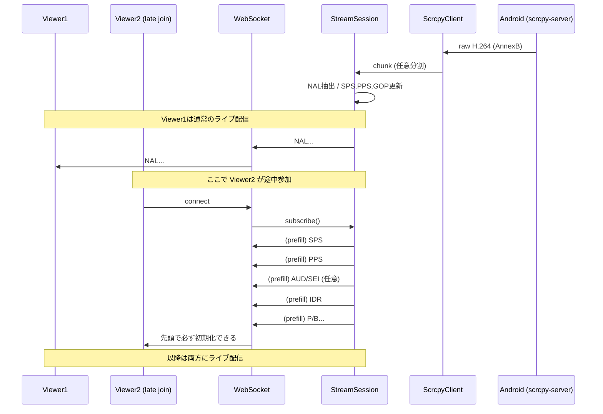

# 途中参加（late join）で白画面になる問題と解決策

## まとめ（結論）

本プロジェクトは `raw_stream=true` の raw H.264 (Annex B) を WebSocket で配信し、ブラウザ側で JMuxer が fMP4(MSE) を生成します。

この構成では、クライアントが途中参加した瞬間に **SPS/PPS + IDR** が揃わないとデコーダ初期化に失敗し、**接続できてバイト数も増えるのに白画面**になります。

解決は以下の 3 点を組み合わせます。

1. **join 時に必ず「初期化できる塊」を先頭に送る（最重要）**
   - サーバが直近の SPS/PPS と「最新GOP（最後のIDRから現在まで）」を保持し、参加直後に `SPS + PPS + (AUD/SEI) + IDR + 以降` をまず送る
2. **エンコーダ設定で途中参加しやすいストリームに寄せる（補助）**
   - `i-frame-interval=1`（1秒ごとにIDR）
   - `prepend-header-to-sync-frames=1`（IDR時にSPS/PPSを繰り返し入れるよう端末に要求、端末依存）
3. **購読者 0→1 復帰時はセッション再起動（補助）**
   - 0人の間にストリームが進むと「完全に途中参加」になるため、最初の購読者は先頭から配信する

---

## 何が起きていたか（症状）

- WebSocket は接続できる
- バイト数は増える（H.264データは届いている）
- しかし `<video>` は白いまま／再生されない
- 特に次のケースで再現しやすい
  - モーダルを閉じてすぐ開き直す（再接続）
  - 1人目が視聴中に 2人目が途中参加する

---

## 根本原因（なぜ白画面になるのか）

### 1) JMuxer/MSE は「初期化情報 + キーフレーム」が必要

H.264 のデコード開始には、最低限次が必要です。

- SPS（Sequence Parameter Set）
- PPS（Picture Parameter Set）
- IDR（Instantaneous Decoder Refresh = キーフレーム）

JMuxer は AnnexB の NAL を受け取りながら、SPS/PPS を見てコーデック情報を確定し、IDR でデコーダを走らせます。

### 2) `raw_stream=true` により「codec meta header」が無い

scrcpy にはストリーム先頭に codec meta を送る仕組みがありますが、`raw_stream=true` では **メタデータを付けない**モードになります。

結果として、途中参加クライアントは **in-band（ストリームの中）で SPS/PPS/IDR を揃えるしかない**ため、取り逃しに弱い構成になります。

### 3) サーバが送っている「チャンク」はNAL境界ではない

ScrcpyClient が `reader.read(65536)` のように TCP から読み出す単位は任意です。

- 1回の read が NAL 1個とは限らない
- NAL の途中で分割されることもある

そのため「キーフレームをキャッシュして送る」を
**チャンク単位で行う**と、SPS/PPS/IDR を正しく再構成できず失敗します。

---

## 解決策（設計）

### A. join 時に「初期化できる塊」を必ず先に送る（最重要）

サーバ側で以下を保持します。

- 直近の `SPS` / `PPS`
- 直近の `AUD/SEI`（あれば）
- **最新GOP**: 「最後のIDRから現在まで」の NAL 列

新しいクライアントが join した瞬間に、まずこのスナップショットを送ります。



ポイントは「次のIDRを待つ」だけではなく、
**SPS/PPS を必ず先頭に添える**ことです。

### B. エンコーダ設定（補助）

途中参加耐性を上げるため、scrcpy-server の codec options を設定します。

- `i-frame-interval=1` : 1秒ごとにIDR
- `prepend-header-to-sync-frames=1` : IDR前にヘッダを繰り返し入れるよう要求（端末依存）

この設定は [packages/android-screen-stream/src/android_screen_stream/config.py](../packages/android-screen-stream/src/android_screen_stream/config.py) の `StreamConfig.to_scrcpy_args()` で組み立てています。

### C. 0→1 の復帰はセッション再起動（補助）

購読者が 0 の間もストリームが進むと、次に join するクライアントは完全な途中参加になります。

そのため `subscriber_count == 0` から復帰する際は、
セッションを restart して「先頭から」配信できる状態に戻します。

---

## 実装（サーバ側）

実装は [packages/android-screen-stream/src/android_screen_stream/session.py](../packages/android-screen-stream/src/android_screen_stream/session.py) にあります。

### 1) AnnexB の NAL 抽出

`_AnnexBExtractor` が raw bytes を受け取り、start code で NAL unit に分解します。

- `00 00 01` / `00 00 00 01` を検出
- 末尾の未確定データはバッファに保持し次回に回す

### 2) SPS/PPS と GOP のキャッシュ

`_update_gop_cache()` が NAL type を見て状態を更新します。

- SPS(7), PPS(8) を保持
- AUD(9), SEI(6) は「直近VCL前prefix」として保持
- IDR(5) が来たら `SPS + PPS + prefix + IDR` で GOP を作り直す
- non-IDR(1) を GOP に追記
- メモリ暴走防止のため GOP サイズに上限を設け、大きすぎる場合は破棄して次の IDR を待つ

### 3) join 時の prefill

`subscribe()` 内で以下を行います。

- 既に購読者がいる（= late join）場合
  - ロック中に GOP スナップショットをキューへ先詰め
  - その後 subscriber を登録

ロック中に詰めることで、
「prefill → ライブ」の順序が崩れないようにしています。

### 4) 送出単位の変更（チャンク→NAL）

`_run_broadcast()` は ScrcpyClient から来た chunk をそのまま送るのではなく、
NAL に分解してキューに入れます。

- late join の prefill と同じ単位で扱うため
- 「初期化塊」を厳密に構成するため

#### 注意（トレードオフ）

- NAL 単位だと WebSocket メッセージ数が増える可能性があります
- 必要なら「複数NALをまとめて 64KB 程度にバッチして送る」最適化が可能です

---

## 検証

### 自動テスト

late joiner の先頭が `SPS -> PPS -> (Pが来る前に) IDR` になることをテストします。

- [packages/android-screen-stream/tests/test_late_join_gop_prefill.py](../packages/android-screen-stream/tests/test_late_join_gop_prefill.py)

### 手動テスト（実運用）

- 1つ目のブラウザで視聴開始
- 数秒後に別タブ/別ウィンドウで同じデバイスに接続
- 2つ目が白画面にならず表示されることを確認

適用が反映されない場合は、バックエンドを再起動してください（コンテナ内のリロード状態に依存します）。

```bash
docker compose restart backend
```

---

## 参考

- H.264 NAL unit type
  - 1: non-IDR slice
  - 5: IDR slice
  - 6: SEI
  - 7: SPS
  - 8: PPS
  - 9: AUD
