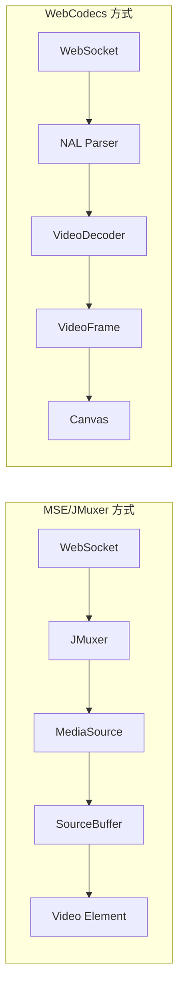

# MSE/JMuxer と WebCodecs の比較

本プロジェクトでは、H.264 ストリーミングの再生に2つの方式を実装しています。
それぞれの特徴とトレードオフを理解し、ユースケースに応じて選択してください。

## アーキテクチャ概要



## 比較表

| 項目 | MSE/JMuxer | WebCodecs |
|------|-----------|-----------|
| **遅延** | 25-65ms | < 10ms |
| **バッファリング** | あり（50-150ms） | なし |
| **なめらかさ** | 高い | ネットワーク品質に依存 |
| **ジッター耐性** | 高い | 低い |
| **ブラウザ対応** | 広い（Safari含む） | Chrome/Edge のみ |
| **実装の複雑さ** | 低い（JMuxer が抽象化） | 高い（NAL 解析が必要） |
| **CPU/GPU 負荷** | 分散 | リアルタイム処理 |

## 遅延の内訳

### MSE/JMuxer 方式

```
Backend処理: < 3ms
WebSocket送信: ~1.5ms
JMuxer処理: < 1ms
MSEバッファリング: 50-150ms  ← ボトルネック
--------------------------
合計: 約 55-155ms（実測 25-65ms）
```

JMuxer の `flushingTime` を 100ms → 10ms に調整することで改善可能だが、
MSE の設計上、ある程度のバッファは避けられない。

### WebCodecs 方式

```
Backend処理: < 3ms
WebSocket送信: ~1.5ms
NAL解析: < 0.5ms
VideoDecoder: < 2ms
Canvas描画: < 1ms
--------------------------
合計: < 10ms
```

バッファを持たないため、ネットワーク遅延 + 処理時間 のみ。

## バッファリングのトレードオフ

### MSE のバッファリングが提供するもの

1. **ジッター吸収**: パケット遅延の変動を平滑化
2. **フレームタイミング調整**: 均一な間隔で再生
3. **A/V 同期**: 音声がある場合の同期処理
4. **デコード負荷分散**: CPU スパイクを抑制

### WebCodecs でバッファがないことの影響

1. **ネットワーク揺らぎが直接見える**: 遅延したフレームはそのまま遅れて表示
2. **フレームドロップが視認される**: パケットロス時にカクつき
3. **不均一なフレーム間隔**: 微妙なカクつきの可能性
4. **リアルタイム処理負荷**: 全フレームを即座にデコード

## ユースケース別の推奨

| ユースケース | 推奨方式 | 理由 |
|-------------|---------|------|
| デバイス操作（タッチ/クリック） | WebCodecs | 操作レスポンスが重要 |
| 動画コンテンツ視聴 | MSE | なめらかさ優先 |
| 安定した LAN 環境 | WebCodecs | ジッターが少ない |
| 不安定な WiFi/モバイル | MSE | バッファで品質維持 |
| デバッグ・監視用途 | WebCodecs | リアルタイム性重視 |
| 複数デバイス同時表示 | MSE | CPU 負荷分散 |

## 使い方

### URL パラメータで切り替え

```
# MSE/JMuxer（デフォルト）
http://localhost:5173/

# WebCodecs
http://localhost:5173/?player=webcodecs
```

### コンポーネント直接使用

```tsx
// MSE/JMuxer
import { H264Player } from 'react-android-screen'
<H264Player wsUrl="/api/ws/stream/device-id" />

// WebCodecs
import { WebCodecsPlayer, isWebCodecsSupported } from 'react-android-screen'
{isWebCodecsSupported() && (
  <WebCodecsPlayer wsUrl="/api/ws/stream/device-id" />
)}
```

## ブラウザ対応状況

### MSE/JMuxer

- ✅ Chrome
- ✅ Edge
- ✅ Firefox
- ✅ Safari

### WebCodecs

- ✅ Chrome 94+
- ✅ Edge 94+
- ❌ Firefox（実装中）
- ❌ Safari（未対応）

WebCodecs を使用する場合は必ずフォールバックを実装してください：

```tsx
if (isWebCodecsSupported()) {
  return <WebCodecsPlayer ... />
} else {
  return <H264Player ... />
}
```

## パフォーマンス測定結果

### 測定環境

- Backend: FastAPI (Docker)
- Frontend: React + Vite
- 接続: localhost（LAN 相当）
- デバイス: Android エミュレータ

### 測定値

| 計測ポイント | MSE/JMuxer | WebCodecs |
|-------------|-----------|-----------|
| Backend 処理 | < 3ms | < 3ms |
| WebSocket RTT | ~3ms | ~3ms |
| Frontend 処理 | < 1ms | < 1ms |
| バッファリング | 16-59ms | ~0ms |
| **体感遅延** | 25-65ms | < 10ms |

## 関連ファイル

- MSE/JMuxer: [H264Player.tsx](../packages/react-android-screen/src/H264Player.tsx)
- WebCodecs: [WebCodecsPlayer.tsx](../packages/react-android-screen/src/WebCodecsPlayer.tsx)
- WebCodecs Hook: [useWebCodecsStream.ts](../packages/react-android-screen/src/useWebCodecsStream.ts)
