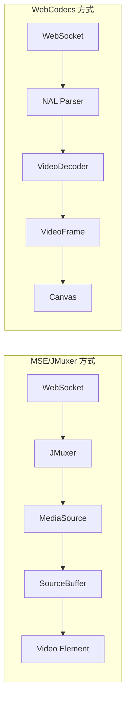

# MSE/JMuxer と WebCodecs の比較

本プロジェクトでは、H.264 ストリーミングの再生に2つの方式を実装しています。
それぞれの特徴とトレードオフを理解し、ユースケースに応じて選択してください。

## アーキテクチャ概要



## 比較表

| 項目 | MSE/JMuxer | WebCodecs |
|------|-----------|-----------|
| **遅延** | 25-65ms | < 10ms |
| **バッファリング** | あり（50-150ms） | なし |
| **なめらかさ** | 高い | ネットワーク品質に依存 |
| **ジッター耐性** | 高い | 低い |
| **ブラウザ対応** | 広い（Safari含む） | Chrome/Edge のみ |
| **実装の複雑さ** | 低い（JMuxer が抽象化） | 高い（NAL 解析が必要） |
| **CPU/GPU 負荷** | 分散 | リアルタイム処理 |

## 遅延の内訳

### MSE/JMuxer 方式

```
Backend処理: < 3ms
WebSocket送信: ~1.5ms
JMuxer処理: < 1ms
MSEバッファリング: 50-150ms  ← ボトルネック
--------------------------
合計: 約 55-155ms（実測 25-65ms）
```

JMuxer の `flushingTime` を 100ms → 10ms に調整することで改善可能だが、
MSE の設計上、ある程度のバッファは避けられない。

### WebCodecs 方式

```
Backend処理: < 3ms
WebSocket送信: ~1.5ms
NAL解析: < 0.5ms
VideoDecoder: < 2ms
Canvas描画: < 1ms
--------------------------
合計: < 10ms
```

バッファを持たないため、ネットワーク遅延 + 処理時間 のみ。

## バッファリングのトレードオフ

### MSE のバッファリングが提供するもの

1. **ジッター吸収**: パケット遅延の変動を平滑化
2. **フレームタイミング調整**: 均一な間隔で再生
3. **A/V 同期**: 音声がある場合の同期処理
4. **デコード負荷分散**: CPU スパイクを抑制

### WebCodecs でバッファがないことの影響

1. **ネットワーク揺らぎが直接見える**: 遅延したフレームはそのまま遅れて表示
2. **フレームドロップが視認される**: パケットロス時にカクつき
3. **不均一なフレーム間隔**: 微妙なカクつきの可能性
4. **リアルタイム処理負荷**: 全フレームを即座にデコード

## ユースケース別の推奨

| ユースケース | 推奨方式 | 理由 |
|-------------|---------|------|
| デバイス操作（タッチ/クリック） | WebCodecs | 操作レスポンスが重要 |
| 動画コンテンツ視聴 | MSE | なめらかさ優先 |
| 安定した LAN 環境 | WebCodecs | ジッターが少ない |
| 不安定な WiFi/モバイル | MSE | バッファで品質維持 |
| デバッグ・監視用途 | WebCodecs | リアルタイム性重視 |
| 複数デバイス同時表示 | MSE | CPU 負荷分散 |

## 使い方

### URL パラメータで切り替え

```
# MSE/JMuxer（デフォルト）
http://localhost:5173/

# WebCodecs
http://localhost:5173/?player=webcodecs
```

### コンポーネント直接使用

```tsx
// MSE/JMuxer
import { H264Player } from 'react-android-screen'
<H264Player wsUrl="/api/ws/stream/device-id" />

// WebCodecs
import { WebCodecsPlayer, isWebCodecsSupported } from 'react-android-screen'
{isWebCodecsSupported() && (
  <WebCodecsPlayer wsUrl="/api/ws/stream/device-id" />
)}
```

## ブラウザ対応状況

### MSE/JMuxer

- ✅ Chrome
- ✅ Edge
- ✅ Firefox
- ✅ Safari

### WebCodecs

- ✅ Chrome 94+
- ✅ Edge 94+
- ❌ Firefox（実装中）
- ❌ Safari（未対応）

WebCodecs を使用する場合は必ずフォールバックを実装してください：

```tsx
if (isWebCodecsSupported()) {
  return <WebCodecsPlayer ... />
} else {
  return <H264Player ... />
}
```

## パフォーマンス測定結果

### 測定環境

- Backend: FastAPI (Docker)
- Frontend: React + Vite
- 接続: localhost（LAN 相当）
- デバイス: Android エミュレータ

### 測定値

| 計測ポイント | MSE/JMuxer | WebCodecs |
|-------------|-----------|-----------|
| Backend 処理 | < 3ms | < 3ms |
| WebSocket RTT | ~3ms | ~3ms |
| Frontend 処理 | < 1ms | < 1ms |
| バッファリング | 16-59ms | ~0ms |
| **体感遅延** | 25-65ms | < 10ms |

## 関連ファイル

- MSE/JMuxer: [H264Player.tsx](../packages/react-android-screen/src/H264Player.tsx)
- WebCodecs: [WebCodecsPlayer.tsx](../packages/react-android-screen/src/WebCodecsPlayer.tsx)
- WebCodecs Hook: [useWebCodecsStream.ts](../packages/react-android-screen/src/useWebCodecsStream.ts)

---

## JMuxer flushingTime チューニング詳細

MSE/JMuxer 方式で遅延を改善するために、JMuxer の `flushingTime` パラメータを調整できます。
このセクションでは、チューニングの詳細とトレードオフを説明します。

### flushingTime とは

JMuxer が内部バッファを MSE の `SourceBuffer` にフラッシュする間隔（ミリ秒）。

```typescript
new JMuxer({
  node: videoElement,
  mode: 'video',
  flushingTime: 10,  // この値を調整
  // ...
})
```

### 変更履歴

| バージョン | flushingTime | 遅延 |
|-----------|-------------|------|
| デフォルト | 100ms | 70-150ms |
| チューニング後 | 10ms | 16-59ms |

### 実装変更箇所

```typescript
// packages/react-android-screen/src/useAndroidStream.ts

// Before
const jmuxer = new JMuxer({
  flushingTime: 100,
  // ...
})

// After
const jmuxer = new JMuxer({
  flushingTime: 10,
  // ...
})
```

### トレードオフ詳細

#### 1. CPU 負荷の増加

`flushingTime` を小さくすると、`SourceBuffer.appendBuffer()` の呼び出し頻度が増加します。

| flushingTime | flush 頻度 | CPU 負荷 |
|--------------|-----------|---------|
| 100ms | 10回/秒 | 低い |
| 50ms | 20回/秒 | やや高い |
| 10ms | 100回/秒 | **10倍** |

**影響**:
- 非力なクライアントでフレームドロップの可能性
- 複数デバイス同時表示時に顕著
- モバイルデバイスでバッテリー消費増加

#### 2. 再生の安定性低下リスク

バッファが薄くなることで、以下のリスクが増加します：

| リスク | 説明 |
|--------|------|
| **ジッター耐性低下** | ネットワーク遅延変動を吸収しにくい |
| **MSE underrun** | バッファが空になり再生が止まる |
| **フレームドロップ** | 処理が追いつかない場合にカクつき |

```
flushingTime: 100ms
[========バッファ========] → 安定
          ↓ 遅延発生
[====バッファ====] → まだ余裕

flushingTime: 10ms
[==バッファ==] → 薄い
     ↓ 遅延発生
[=] → 危険！underrun のリスク
```

#### 3. ブラウザ間の挙動差

MSE の実装はブラウザごとに異なるため、攻めた設定は互換性問題を起こす可能性があります。

| ブラウザ | flushingTime: 10ms |
|---------|-------------------|
| Chrome | ✅ 問題なし |
| Edge | ✅ 問題なし |
| Firefox | ⚠️ 挙動が異なる可能性 |
| Safari | ⚠️ MSE 実装が独自、要検証 |

#### 4. バッテリー消費（モバイル）

CPU 負荷増加に伴い、モバイルデバイスではバッテリー消費が増加します。
長時間のストリーミング視聴では顕著な差が出る可能性があります。

### ユースケース別推奨値

| ユースケース | 推奨 flushingTime | 理由 |
|-------------|------------------|------|
| デバイス操作（LAN） | 10ms | 操作レスポンス最優先 |
| デバイス操作（WiFi） | 20-30ms | ジッター考慮 |
| 動画視聴 | 50-100ms | なめらかさ優先 |
| 不安定なネットワーク | 100ms+ | バッファで吸収 |
| 複数デバイス同時 | 50ms+ | CPU 負荷分散 |
| Safari 対応必須 | 50ms+ | 互換性重視 |

### 動的調整の可能性

ネットワーク品質に応じて `flushingTime` を動的に調整する戦略も検討可能です：

```typescript
// 疑似コード: RTT に応じて flushingTime を調整
function calculateFlushingTime(rttMs: number): number {
  if (rttMs < 10) return 10    // 非常に安定
  if (rttMs < 30) return 20    // 安定
  if (rttMs < 100) return 50   // やや不安定
  return 100                    // 不安定
}
```

現時点では未実装ですが、将来的な改善オプションとして記録しておきます。

### 測定方法

遅延を測定するために、以下のエンドポイントとスクリプトを追加しました：

#### Backend 測定エンドポイント

```
GET /api/latency/ping
POST /api/latency/echo
```

#### 測定スクリプト

```bash
# scripts/measure_latency.py
python scripts/measure_latency.py --host localhost --port 8000
```

#### Frontend ログ

JMuxer にデータを渡すタイミングでログを出力：

```typescript
if (debug) {
  console.log(`[H264] Feed: size=${data.length}, time=${Date.now()}`)
}
```

### 結論

`flushingTime: 10ms` は **LAN 環境でのデバイス操作** に最適化された設定です。
以下の条件では、より大きな値を検討してください：

- 不安定なネットワーク環境
- 非力なクライアントデバイス
- Safari / Firefox 対応が必須
- 複数デバイスの同時表示
- バッテリー消費を抑えたい場合

最も低遅延を求める場合は、MSE の限界を超えて WebCodecs 方式を検討してください。

