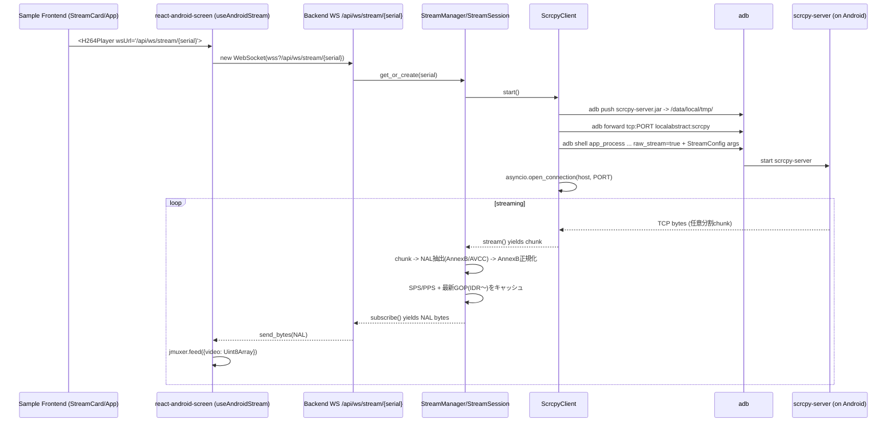

# scrcpy-server → Browser (JMuxer/MSE) までの H.264 ストリーミング経路（end-to-end）

作成日: 2026-01-31

この文書は、以下3つの実装を突き合わせて「scrcpy-server から raw H.264 が流れて、ブラウザの `<video>` で再生されるまで」の経路を図と文章で整理したものです。

- Backend (FastAPI)
- Python ライブラリ: android-screen-stream
- React ライブラリ: react-android-screen
- サンプルフロント: examples/simple-viewer

---

## 1. コンポーネント構成（俯瞰）

```mermaid
graph LR
  subgraph Android[Android Device]
    S[scrcpy-server\n(raw_stream=true)]
    UDS[localabstract:scrcpy\n(unix domain socket)]
    S --> UDS
  end

  subgraph Host[Backend (FastAPI + android-screen-stream)]
    ADB[adb forward\n tcp:PORT -> localabstract:scrcpy]
    C[ScrcpyClient\n(adb push/forward/shell + TCP read)]
    SS[StreamSession\n(NAL抽出 + late-join GOP prefill)]
    WS[FastAPI WebSocket\n/api/ws/stream/{serial}]
    ADB --> C --> SS --> WS
  end

  subgraph Browser[Browser (react-android-screen + JMuxer)]
    WSC[WebSocket client\narraybuffer]
    JM[JMuxer\nAnnexB -> fMP4(MSE)]
    V[<video>\nMSE playback]
    WSC --> JM --> V
  end

  WS --> WSC
```

---

## 2. データフロー（時系列）



---

## 3. 実装対応表（どこが何をしているか）

### 3.1 Backend: WS エンドポイント（H.264 の配信口）

- `WS /api/ws/stream/{serial}`
- 接続すると `StreamManager.get_or_create(serial)` を呼び、`StreamSession.subscribe()` の yields を `websocket.send_bytes()` で送る

該当:
- backend/app/api/endpoints/stream.py

### 3.2 Backend: StreamManager の DI（起動時に生成される）

- FastAPI lifespan で `app.state.stream_manager = StreamManager(...)` をセット

該当:
- backend/app/main.py

### 3.3 android-screen-stream: scrcpy-server 起動（adb 経由）と TCP 受信

- jar を端末へ push
- `adb forward tcp:PORT localabstract:scrcpy`
- `adb shell ... app_process ... com.genymobile.scrcpy.Server ... raw_stream=true ...` でサーバ起動
- `asyncio.open_connection(host, PORT)` でローカル TCP に接続し、`reader.read(65536)` で任意分割 chunk を読む

該当:
- packages/android-screen-stream/src/android_screen_stream/client.py

### 3.4 android-screen-stream: chunk を NAL に揃える（正しさの中核）

**背景**: TCP `read()` の単位は NAL 境界ではありません。

- 上流は端末/設定により Annex-B or AVCC の可能性があるため、両方を検出
- 返却する単位を Annex-B (`00 00 00 01`) の NAL bytes に正規化
- 未確定末尾はバッファ保持し、次回入力で確定

該当:
- packages/android-screen-stream/src/android_screen_stream/session.py (`_H264UnitExtractor`)

### 3.5 android-screen-stream: late join（途中参加）対策（白画面回避の中核）

**症状**: `raw_stream=true` はメタヘッダなしで流れるため、途中参加したクライアントが SPS/PPS/IDR を揃えられないと白画面になりやすい。

**対策**:
- `StreamSession` が SPS/PPS と「最新 GOP（最後のIDRから現在まで）」を保持
- すでに視聴者がいる状態での新規購読（late join）では、購読開始時に `SPS + PPS + (AUD/SEI) + IDR + 以降` を先にキューへ詰めて送る
- さらに補助策として、購読者が0→1へ戻る際にストリームが進んでいたらセッション再起動して「先頭から」に寄せる

該当:
- packages/android-screen-stream/src/android_screen_stream/session.py

### 3.6 react-android-screen: WebSocket 受信 → JMuxer → `<video>` 再生

- `WebSocket.binaryType = 'arraybuffer'`
- `onmessage` で受けた `ArrayBuffer` を `Uint8Array` にし、JMuxer の `feed({ video: data })` に渡す
- SPS（type=7）を軽量検出し、SPSが変わったら JMuxer を reset して MSE 再初期化（画面回転/解像度変更対応）
- ライブ視聴用途の遅延追従（liveSync）と固まり復旧（stallRecovery）あり

該当:
- packages/react-android-screen/src/useAndroidStream.ts
- packages/react-android-screen/src/H264Player.tsx

### 3.7 サンプルフロント: どの URL に繋いでいるか

- ストリーミング本線: `/api/ws/stream/{serial}`
- デバイス一覧更新: SSE `/api/events`（`event: devices`）

該当:
- examples/simple-viewer/frontend/src/components/StreamCard.tsx
- examples/simple-viewer/frontend/src/App.tsx

---

## 4. 重要な設計上のポイント（失敗しやすい所）

1) **TCP read は NAL 境界ではない**
- chunk 単位で “キーフレームをキャッシュして送る” をやると壊れる
- そのため NAL 抽出 → NAL 単位配信に揃えている

2) **raw_stream=true は途中参加に弱い**
- in-band で SPS/PPS/IDR を揃える必要がある
- そのため Backend 側で GOP prefill をしている

3) **解像度変更（回転等）で SPS が変わる**
- ブラウザ側で MSE 初期化情報が変わるため、JMuxer reset が必要

---

## 5. 参照（このリポジトリ内）

- docs/architecture.md
- docs/backend-openapi.md
- docs/late-join.md
