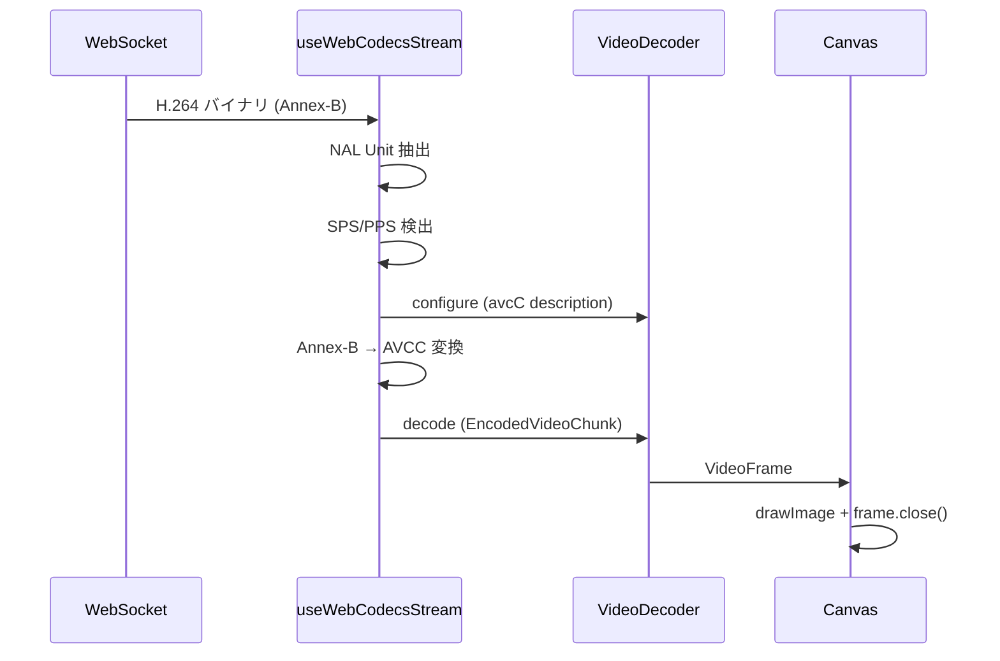

# WebCodecs 実装の詳細

本ドキュメントでは、WebCodecs を使った低遅延 H.264 プレイヤーの実装詳細と、
開発中に遭遇した問題とその解決策を記録します。

## 実装概要

### ファイル構成

```
packages/react-android-screen/src/
├── useWebCodecsStream.ts   # WebCodecs Hook（NAL 解析、デコード）
├── WebCodecsPlayer.tsx     # React コンポーネント（UI、再接続）
└── index.ts                # エクスポート
```

### データフロー



## H.264 フォーマット変換

### 問題: Annex-B vs AVCC

scrcpy から送られる H.264 は **Annex-B 形式**（ストリーミング向け）だが、
WebCodecs の `VideoDecoder` は **AVCC 形式**（MP4 向け）を期待する。

| 形式 | NAL 区切り | 用途 |
|------|-----------|------|
| Annex-B | `00 00 00 01` または `00 00 01` | ストリーミング、.h264 ファイル |
| AVCC | 4-byte length prefix (big-endian) | MP4、WebCodecs |

### 解決策 1: NAL Unit の抽出

```typescript
function extractNalUnits(data: Uint8Array): Uint8Array[] {
  const nalUnits: Uint8Array[] = []
  let start = -1

  for (let i = 0; i < data.length - 3; i++) {
    // 3-byte または 4-byte start code を検出
    const is4ByteStart = data[i] === 0 && data[i + 1] === 0 && 
                         data[i + 2] === 0 && data[i + 3] === 1
    const is3ByteStart = data[i] === 0 && data[i + 1] === 0 && data[i + 2] === 1

    if (is4ByteStart || is3ByteStart) {
      if (start >= 0) {
        nalUnits.push(data.slice(start, i))
      }
      start = i
    }
  }

  if (start >= 0) {
    nalUnits.push(data.slice(start))
  }

  return nalUnits
}
```

### 解決策 2: AVCC 形式への変換

```typescript
// Start code を除去
function stripStartCode(nalUnit: Uint8Array): Uint8Array {
  if (nalUnit[0] === 0 && nalUnit[1] === 0 && 
      nalUnit[2] === 0 && nalUnit[3] === 1) {
    return nalUnit.slice(4)  // 4-byte start code
  } else if (nalUnit[0] === 0 && nalUnit[1] === 0 && nalUnit[2] === 1) {
    return nalUnit.slice(3)  // 3-byte start code
  }
  return nalUnit
}

// AVCC 形式に変換（4-byte length prefix）
const nalData = stripStartCode(nalUnit)
const avccData = new Uint8Array(4 + nalData.length)
avccData[0] = (nalData.length >> 24) & 0xff
avccData[1] = (nalData.length >> 16) & 0xff
avccData[2] = (nalData.length >> 8) & 0xff
avccData[3] = nalData.length & 0xff
avccData.set(nalData, 4)
```

## VideoDecoderConfig.description

### 問題: codec 文字列だけでは不十分

```typescript
// ❌ これだけでは動作しない
decoder.configure({
  codec: 'avc1.42c029',
})
```

WebCodecs は AVCC 形式を期待するため、`description` に **avcC box** を渡す必要がある。

### 解決策: SPS/PPS から avcC box を構築

```typescript
function buildAvcCDescription(sps: Uint8Array, pps: Uint8Array): Uint8Array {
  // avcC box format:
  // - configurationVersion (1 byte) = 1
  // - AVCProfileIndication (1 byte) = sps[1]
  // - profile_compatibility (1 byte) = sps[2]
  // - AVCLevelIndication (1 byte) = sps[3]
  // - lengthSizeMinusOne (1 byte) = 0xff (4-byte prefix)
  // - numOfSequenceParameterSets (1 byte) = 0xe1 (1個)
  // - SPS length (2 bytes, big-endian)
  // - SPS data
  // - numOfPictureParameterSets (1 byte) = 1
  // - PPS length (2 bytes, big-endian)
  // - PPS data

  const avcC = new Uint8Array(11 + sps.length + pps.length)
  let offset = 0

  avcC[offset++] = 1                              // configurationVersion
  avcC[offset++] = sps[1]                         // AVCProfileIndication
  avcC[offset++] = sps[2]                         // profile_compatibility
  avcC[offset++] = sps[3]                         // AVCLevelIndication
  avcC[offset++] = 0xff                           // lengthSizeMinusOne = 3
  avcC[offset++] = 0xe1                           // numOfSPS = 1
  avcC[offset++] = (sps.length >> 8) & 0xff       // SPS length (high)
  avcC[offset++] = sps.length & 0xff              // SPS length (low)
  avcC.set(sps, offset)
  offset += sps.length
  avcC[offset++] = 1                              // numOfPPS = 1
  avcC[offset++] = (pps.length >> 8) & 0xff       // PPS length (high)
  avcC[offset++] = pps.length & 0xff              // PPS length (low)
  avcC.set(pps, offset)

  return avcC
}
```

### コーデック文字列の生成

```typescript
function buildCodecString(sps: Uint8Array): string {
  // SPS の先頭 3 バイトからプロファイル情報を取得
  // start code をスキップした後の位置
  let offset = 0
  if (sps[0] === 0 && sps[1] === 0 && sps[2] === 0 && sps[3] === 1) {
    offset = 5  // 4-byte start code + NAL header
  } else if (sps[0] === 0 && sps[1] === 0 && sps[2] === 1) {
    offset = 4  // 3-byte start code + NAL header
  } else {
    offset = 1  // NAL header のみ
  }

  const profileIdc = sps[offset]
  const profileCompatibility = sps[offset + 1]
  const levelIdc = sps[offset + 2]

  // avc1.XXYYZZ 形式
  const hex = (n: number) => n.toString(16).padStart(2, '0')
  return `avc1.${hex(profileIdc)}${hex(profileCompatibility)}${hex(levelIdc)}`
}
```

## NAL Unit タイプの処理

### NAL タイプの識別

```typescript
const NAL_TYPE_SPS = 7      // Sequence Parameter Set
const NAL_TYPE_PPS = 8      // Picture Parameter Set
const NAL_TYPE_IDR = 5      // キーフレーム（I フレーム）
const NAL_TYPE_NON_IDR = 1  // 差分フレーム（P/B フレーム）

function getNalType(nalUnit: Uint8Array): number {
  // start code をスキップして NAL header を取得
  let offset = 0
  if (nalUnit[0] === 0 && nalUnit[1] === 0 && 
      nalUnit[2] === 0 && nalUnit[3] === 1) {
    offset = 4
  } else if (nalUnit[0] === 0 && nalUnit[1] === 0 && nalUnit[2] === 1) {
    offset = 3
  }
  return nalUnit[offset] & 0x1f  // 下位 5 ビットが NAL type
}
```

### 処理順序

1. **SPS 受信**: 保存して configure 準備
2. **PPS 受信**: 保存して configure 実行
3. **IDR 受信**: `type: 'key'` でデコード開始
4. **non-IDR 受信**: `type: 'delta'` でデコード

```typescript
if (nalType === NAL_TYPE_SPS) {
  spsRef.current = nalUnit
}
if (nalType === NAL_TYPE_PPS) {
  ppsRef.current = nalUnit
}

// SPS と PPS が揃ったら configure
if (!isConfiguredRef.current && spsRef.current && ppsRef.current) {
  decoder.configure({
    codec: buildCodecString(spsRef.current),
    description: buildAvcCDescription(
      stripStartCode(spsRef.current),
      stripStartCode(ppsRef.current)
    ),
    optimizeForLatency: true,
  })
  isConfiguredRef.current = true
}

// デコード
if (isConfiguredRef.current && (nalType === NAL_TYPE_IDR || nalType === NAL_TYPE_NON_IDR)) {
  const chunk = new EncodedVideoChunk({
    type: nalType === NAL_TYPE_IDR ? 'key' : 'delta',
    timestamp: timestampRef.current,
    data: avccData,
  })
  decoder.decode(chunk)
  timestampRef.current += 33333  // 30fps = 33.333ms
}
```

## React Hooks の依存配列問題

### 問題: 無限再接続ループ

初期実装では、WebSocket が約 3 秒ごとに切断・再接続を繰り返す問題が発生。

```typescript
// ❌ 問題のあるコード
const connect = useCallback(() => {
  // ... 接続処理 ...
}, [wsUrl, debug, isSupported, onConnected, onDisconnected, onError, disconnect])

useEffect(() => {
  if (autoConnect && isSupported) {
    connect()
    return () => disconnect()
  }
}, [wsUrl, autoConnect, isSupported, connect, disconnect])
```

**原因**: `onConnected` などのコールバックが親コンポーネントで新しい関数として渡されるたび、
`connect` が再生成され、`useEffect` が再実行されて `disconnect()` → `connect()` が発生。

### 解決策: コールバックを ref で安定させる

```typescript
// ✅ 修正後
// コールバックを ref で保持
const onConnectedRef = useRef(onConnected)
const onDisconnectedRef = useRef(onDisconnected)
const onErrorRef = useRef(onError)
const debugRef = useRef(debug)

// コールバックを同期（値の変更は追従するが、ref 自体は安定）
useEffect(() => {
  onConnectedRef.current = onConnected
  onDisconnectedRef.current = onDisconnected
  onErrorRef.current = onError
  debugRef.current = debug
}, [onConnected, onDisconnected, onError, debug])

// connect は安定した依存のみ
const connect = useCallback(() => {
  // ref 経由でコールバックを呼び出し
  onConnectedRef.current?.()
  // ...
}, [wsUrl, isSupported, disconnect])  // コールバックは依存に含めない

// connect/disconnect も ref で保持
const connectRef = useRef(connect)
const disconnectRef = useRef(disconnect)
useEffect(() => {
  connectRef.current = connect
  disconnectRef.current = disconnect
}, [connect, disconnect])

// 自動接続の useEffect は安定
useEffect(() => {
  if (autoConnect && isSupported) {
    const timer = setTimeout(() => {
      connectRef.current()  // ref 経由で呼び出し
    }, 100)
    return () => {
      clearTimeout(timer)
      disconnectRef.current()
    }
  }
}, [wsUrl, autoConnect, isSupported])  // connect/disconnect を依存から除外
```

## メモリ管理

### VideoFrame の解放（必須）

`VideoFrame` は GPU/ビデオメモリを保持するため、使用後に `close()` を呼ばないとメモリリークが発生。

```typescript
const decoder = new VideoDecoder({
  output: (frame: VideoFrame) => {
    ctx.drawImage(frame, 0, 0)
    frame.close()  // ← 必須！忘れるとメモリリーク
  },
  // ...
})
```

### リソースのクリーンアップ

```typescript
const disconnect = useCallback(() => {
  // WebSocket を閉じる
  if (wsRef.current) {
    wsRef.current.close()
    wsRef.current = null
  }
  
  // VideoDecoder を閉じる
  if (decoderRef.current) {
    try {
      decoderRef.current.close()
    } catch (e) {
      // すでに閉じている場合は無視
    }
    decoderRef.current = null
  }
  
  // 状態をリセット
  isConfiguredRef.current = false
  spsRef.current = null
  ppsRef.current = null
}, [])
```

### メモリリークがないことの確認

Chrome DevTools で確認：

```javascript
// コンソールで実行
if (performance.memory) {
  console.log({
    usedJSHeapSize: (performance.memory.usedJSHeapSize / 1024 / 1024).toFixed(2) + ' MB',
    totalJSHeapSize: (performance.memory.totalJSHeapSize / 1024 / 1024).toFixed(2) + ' MB',
  })
}
```

30秒のストリーミング後もメモリ使用量が増加しないことを確認済み。

## ブラウザ互換性チェック

```typescript
export function isWebCodecsSupported(): boolean {
  return typeof VideoDecoder !== 'undefined' && 
         typeof EncodedVideoChunk !== 'undefined'
}
```

使用時は必ずチェック：

```tsx
if (isWebCodecsSupported()) {
  return <WebCodecsPlayer wsUrl={wsUrl} />
} else {
  return <H264Player wsUrl={wsUrl} />  // フォールバック
}
```

## 低遅延設定

```typescript
decoder.configure({
  codec: codecString,
  description: description,
  optimizeForLatency: true,  // ← 低遅延モード
})
```

`optimizeForLatency: true` により、デコーダーはバッファリングを最小化し、
フレームを可能な限り早く出力する。

## トラブルシューティング

### デコードエラー

```
DOMException: Failed to execute 'decode' on 'VideoDecoder': 
A key frame is required after configure() or flush()
```

**原因**: IDR フレームなしで non-IDR フレームをデコードしようとした
**対策**: SPS/PPS/IDR を受信してから non-IDR をデコード開始

### 設定エラー

```
TypeError: Failed to execute 'configure' on 'VideoDecoder': 
description is not a BufferSource
```

**原因**: `description` に無効なデータを渡した
**対策**: SPS/PPS から正しく avcC box を構築

### 接続ループ

**症状**: 3秒ごとに接続・切断を繰り返す
**原因**: React Hooks の依存配列問題
**対策**: コールバックを ref で安定させる（上記参照）

## 関連ドキュメント

- [MSE/JMuxer と WebCodecs の比較](./mse-vs-webcodecs.md)
- [アーキテクチャ](./architecture.md)
- [WebCodecs API (MDN)](https://developer.mozilla.org/en-US/docs/Web/API/WebCodecs_API)
- [H.264 NAL Unit Types](https://yumichan.net/video-processing/video-compression/introduction-to-h264-nal-unit/)
