# android-capture-client

Android スクリーンキャプチャクライアントライブラリ

screen-stream-capture バックエンドの WebSocket キャプチャ API に接続し、
任意のタイミングでスクリーンショットを取得するための Python ライブラリです。

## 特徴

- 🔌 **常時接続**: WebSocket でバックエンドと常時接続し、いつでもキャプチャ可能
- 🧵 **非同期設計**: WebSocket 通信はバックグラウンドで動作（`capture()` 自体は同期APIで結果待ちします）
- 🛡️ **安全なリソース管理**: コンテキストマネージャで確実に接続を解放
- 📸 **シンプル API**: `capture()` メソッドで即座にスクリーンショットを取得

## アーキテクチャ

このライブラリは **2つのAPI** を提供し、アプリの設計に応じて選択できます。


### どちらを使うべき？

| アプリの種類 | 推奨クラス | 理由 |
|------------|-----------|------|
| **asyncio アプリ** (FastAPI, browser-use, aiohttp) | `CaptureClient` | イベントループを共有し効率的 |
| **同期アプリ** (通常のスクリプト、GUI アプリ) | `CaptureSession` | 内部で asyncio を管理 |

## インストール

```bash
uv add --editable /path/to/packages/android-capture-client
```

## 前提条件（バックエンド起動）

このライブラリの WebSocket API は、screen-stream-capture のバックエンドに接続して動作します。
そのため **デモ実行やテスト実行の前に、バックエンドが起動している必要があります**。

- バックエンド起動手順（推奨）: [../../README.md](../../README.md) の「クイックスタート」
- Docker を使わずにバックエンドのみ起動: [../../backend/scripts/run_local.sh](../../backend/scripts/run_local.sh)

起動後の目安:

- Swagger UI: `http://localhost:8000/docs`
- ヘルスチェック: `http://localhost:8000/api/health`

## クイックスタート

### 基本的な使い方

```python
import asyncio
from android_capture_client import CaptureClient

async def main():
    async with CaptureClient("emulator-5554", backend_url="ws://localhost:8000") as client:
        # スクリーンショットを取得
        result = await client.capture()
        
        # JPEG データを保存
        with open("screenshot.jpg", "wb") as f:
            f.write(result.jpeg_data)
        
        print(f"Captured: {result.width}x{result.height}")

asyncio.run(main())
```

### 同期コードからの利用（バックグラウンドスレッド）

```python
from android_capture_client import CaptureSession

# セッション開始（バックグラウンドスレッドで動作）
session = CaptureSession("emulator-5554", backend_url="ws://localhost:8000")
session.start()

# メインスレッドをブロックせずにキャプチャ
result = session.capture(timeout=5.0)
print(f"Captured: {result.width}x{result.height}")

# 複数回キャプチャ可能
for i in range(3):
    result = session.capture()
    with open(f"screenshot_{i}.jpg", "wb") as f:
        f.write(result.jpeg_data)

# 終了時に明示的に停止
session.stop()
```

### コンテキストマネージャでの利用

```python
from android_capture_client import CaptureSession

with CaptureSession("emulator-5554") as session:
    result = session.capture()
    # ...
# 自動的に接続が解放される
```

## 利用パターン詳細

### パターン1: asyncio アプリ（FastAPI, browser-use など）

asyncio ベースのアプリでは、`CaptureClient` を直接使用します。
イベントループを共有するため、最も効率的です。

```python
# FastAPI での例
from fastapi import FastAPI
from android_capture_client import CaptureClient

app = FastAPI()
client: CaptureClient | None = None

@app.on_event("startup")
async def startup():
    global client
    client = CaptureClient("emulator-5554", backend_url="ws://localhost:8000")
    await client.connect()

@app.on_event("shutdown")
async def shutdown():
    if client:
        await client.close()

@app.get("/screenshot")
async def screenshot():
    # 完全に非同期で動作
    result = await client.capture()
    return {"width": result.width, "height": result.height}
```

```python
# browser-use での例
from android_capture_client import CaptureClient

async def my_browser_use_task():
    async with CaptureClient("emulator-5554") as client:
        # browser-use のタスク中にキャプチャ
        result = await client.capture()  # 非ブロッキング
        # 他の async 処理と並行して動作可能
```

### パターン2: 同期アプリで非ブロッキングキャプチャ

同期アプリで `session.capture()` を呼ぶと、**結果が返るまで呼び出し元はブロック**されます。
ただし、WebSocket 接続はバックグラウンドスレッドで管理されているため、
**他のスレッドからのキャプチャリクエストは並行して処理**できます。

メインスレッドを完全にブロックしたくない場合は、`ThreadPoolExecutor` を使用します：

```python
from android_capture_client import CaptureSession
from concurrent.futures import ThreadPoolExecutor
import time

session = CaptureSession("emulator-5554")
session.start()

executor = ThreadPoolExecutor(max_workers=2)

def capture_async():
    """別スレッドでキャプチャを実行"""
    future = executor.submit(session.capture)
    return future  # 即座に返る（ブロックしない）

# メインループ
print("メインループ開始")
capture_future = capture_async()  # 即座に返る

# メイン処理を続行
for i in range(5):
    print(f"メイン処理中... {i}")
    time.sleep(0.1)

# キャプチャ結果を取得（必要なときに待機）
result = capture_future.result()
print(f"キャプチャ完了: {result.width}x{result.height}")

session.stop()
executor.shutdown()
```

### パターン3: GUI アプリ（Tkinter, PyQt など）

GUI アプリではメインスレッドをブロックするとUIがフリーズします。
バックグラウンドスレッドでキャプチャし、コールバックで結果を受け取ります：

```python
import tkinter as tk
from android_capture_client import CaptureSession
from concurrent.futures import ThreadPoolExecutor
from PIL import Image
import io

class App:
    def __init__(self):
        self.root = tk.Tk()
        self.session = CaptureSession("emulator-5554")
        self.executor = ThreadPoolExecutor(max_workers=1)
        
        self.btn = tk.Button(self.root, text="Capture", command=self.on_capture)
        self.btn.pack()
        
        self.session.start()
    
    def on_capture(self):
        """ボタンクリック時（UIスレッドをブロックしない）"""
        future = self.executor.submit(self.session.capture)
        # 結果を定期的にチェック
        self.root.after(100, lambda: self.check_result(future))
    
    def check_result(self, future):
        if future.done():
            result = future.result()
            print(f"Captured: {result.width}x{result.height}")
            # 画像を表示する処理...
        else:
            # まだ完了していない場合は再チェック
            self.root.after(100, lambda: self.check_result(future))
    
    def run(self):
        self.root.mainloop()
        self.session.stop()
        self.executor.shutdown()
```

### 注意事項

#### CaptureSession.capture() の動作

`capture()` メソッドは**呼び出し元スレッドをブロック**します。
メインスレッドをブロックしたくない場合は `ThreadPoolExecutor` を使用してください。


#### ThreadPoolExecutor で非ブロッキング化

`ThreadPoolExecutor` を使うと、メインスレッドをブロックせずにキャプチャできます。


### デモの動作シーケンス

`capture-demo` コマンドは `ThreadPoolExecutor` を使って非ブロッキングキャプチャを実現しています。

```mermaid
sequenceDiagram
    autonumber
    participant Main as メインスレッド<br/>(input待ち)
    participant Counter as Counterスレッド<br/>(0.1秒ごと)
    participant Executor as CaptureWorker<br/>(ThreadPoolExecutor)
    participant Session as CaptureSession内部<br/>(asyncio)
    participant WS as WebSocket<br/>(Backend)

    Note over Main,WS: 初期化フェーズ
    
    Main->>Session: CaptureSession() 作成
    Session->>Session: バックグラウンドスレッド起動
    Session->>WS: WebSocket 接続
    WS-->>Session: 接続確立
    
    Main->>Counter: counter_thread.start()
    activate Counter
    
    Note over Main,WS: インタラクティブループ

    loop Counterスレッド（常時動作）
        Counter->>Counter: _counter += 1
        Counter->>Counter: sleep(0.1)
    end

    Main->>Main: input() でユーザー入力待機
    Note over Main: ユーザーが "c" を入力

    rect rgb(200, 255, 200)
        Note over Main,Executor: 非ブロッキングキャプチャ
        Main->>Main: counter_before = 100
        Main->>Executor: executor.submit(_do_capture)
        Note right of Main: 即座に返る
        Main->>Main: counter_after = 100
        Main->>Main: print("Started")
        Main->>Main: input() で次の入力待機
    end

    rect rgb(255, 220, 200)
        Note over Executor,WS: 別スレッドでキャプチャ実行
        Executor->>Session: session.capture()
        activate Executor
        Session->>WS: {"type": "capture"}
        WS-->>Session: {"type": "jpeg", data: ...}
        Session-->>Executor: CaptureResult
        deactivate Executor
    end

    Executor->>Main: コールバックで結果を表示
```



### スレッドの責任分担

| スレッド | 役割 | ブロック？ |
|---------|------|-----------|
| **メインスレッド** | input() 待機、コマンド発行 | input() でのみ |
| **Counterスレッド** | カウンターインクリメント（証明用） | なし |
| **CaptureWorker** | `session.capture()` を実行 | **ブロック** |
| **Session内部** | asyncio + WebSocket 通信 | なし（非同期） |

#### 複数デバイスの並行キャプチャ

```python
from android_capture_client import CaptureSession
from concurrent.futures import ThreadPoolExecutor

sessions = {
    "device1": CaptureSession("emulator-5554"),
    "device2": CaptureSession("emulator-5556"),
}

for s in sessions.values():
    s.start()

with ThreadPoolExecutor(max_workers=len(sessions)) as executor:
    # 全デバイスを並行してキャプチャ
    futures = {
        name: executor.submit(session.capture)
        for name, session in sessions.items()
    }
    
    for name, future in futures.items():
        result = future.result()
        print(f"{name}: {result.width}x{result.height}")

for s in sessions.values():
    s.stop()
```

## API リファレンス

### CaptureClient（非同期）

```python
class CaptureClient:
    def __init__(
        self,
        serial: str,
        backend_url: str = "ws://localhost:8000",
        connect_timeout: float = 10.0,
        capture_timeout: float = 30.0,
        init_wait: float = 8.0,       # 接続後のデコーダ初期化待機時間
        max_retries: int = 3,          # CAPTURE_TIMEOUT時のリトライ回数
        retry_delay: float = 1.0,      # リトライ間隔（秒）
    ): ...
    
    async def connect(self) -> None: ...
    async def disconnect(self) -> None: ...
    async def capture(
        self,
        quality: int = 80,
        save: bool = False,
    ) -> CaptureResult: ...
```

### CaptureSession（同期ラッパー）

```python
class CaptureSession:
    def __init__(
        self,
        serial: str,
        backend_url: str = "ws://localhost:8000",
        connect_timeout: float = 10.0,
        capture_timeout: float = 30.0,
        init_wait: float = 8.0,       # 接続後のデコーダ初期化待機時間
        max_retries: int = 3,          # CAPTURE_TIMEOUT時のリトライ回数
        retry_delay: float = 1.0,      # リトライ間隔（秒）
    ): ...
    
    def start(self) -> None: ...
    def stop(self) -> None: ...
    def capture(
        self,
        quality: int = 80,
        save: bool = False,
        timeout: float = 10.0,
    ) -> CaptureResult: ...
```

### CaptureResult

```python
@dataclass
class CaptureResult:
    capture_id: str
    serial: str
    width: int
    height: int
    jpeg_data: bytes
    captured_at: str
    path: str | None  # save=True の場合のみ
```

## デモアプリ

インタラクティブな CUI デモが含まれています:

```bash
# バックエンドが起動している状態で実行
capture-demo --serial emulator-5554 --backend ws://localhost:8000
```

ブロッキング/非ブロッキングの挙動を**明確に分けて**確認したい場合は、以下も利用できます:

```bash
# CaptureSession.capture() がブロッキングであることを確認
capture-demo-simple --serial emulator-5554 --backend ws://localhost:8000

# ThreadPoolExecutor で非ブロッキング化できることを確認
capture-demo-nonblocking --serial emulator-5554 --backend ws://localhost:8000
```

## テスト

本パッケージはバックエンドに依存するため、（pytest を追加して実行する場合を含め）
**テスト実行前にバックエンドを起動してください**。

- バックエンド起動: [../../README.md](../../README.md) / [../../backend/scripts/run_local.sh](../../backend/scripts/run_local.sh)

## 注意事項

- バックエンドが起動していること
- バックエンド起動方法: [../../README.md](../../README.md) / [../../backend/scripts/run_local.sh](../../backend/scripts/run_local.sh)
- 指定したデバイスが adb で接続されていること

### ⚠️ 初期化待機時間について

WebSocket 接続後、最初のキャプチャが可能になるまで **約6〜8秒** かかります。
これはバックエンドがH.264デコーダを起動し、最初のフレームをデコードするためです。

| タイミング | 所要時間 | 説明 |
|-----------|---------|------|
| 接続〜初回キャプチャ可能 | 約6〜8秒 | デコーダ起動 + フレームデコード |
| 2回目以降のキャプチャ | 約60〜120ms | デコード済みフレームのJPEGエンコード |

このライブラリでは `init_wait` パラメータ（デフォルト: 8秒）で自動的に待機します。
また、`CAPTURE_TIMEOUT` エラー時は自動リトライ（デフォルト: 3回）を行います。

```python
# 初期化待機時間をカスタマイズ
CaptureSession(
    serial="emulator-5554",
    init_wait=10.0,      # 接続後の待機時間（秒）
    max_retries=5,       # タイムアウト時のリトライ回数
    retry_delay=2.0,     # リトライ間隔（秒）
)
```

## ライセンス

MIT
