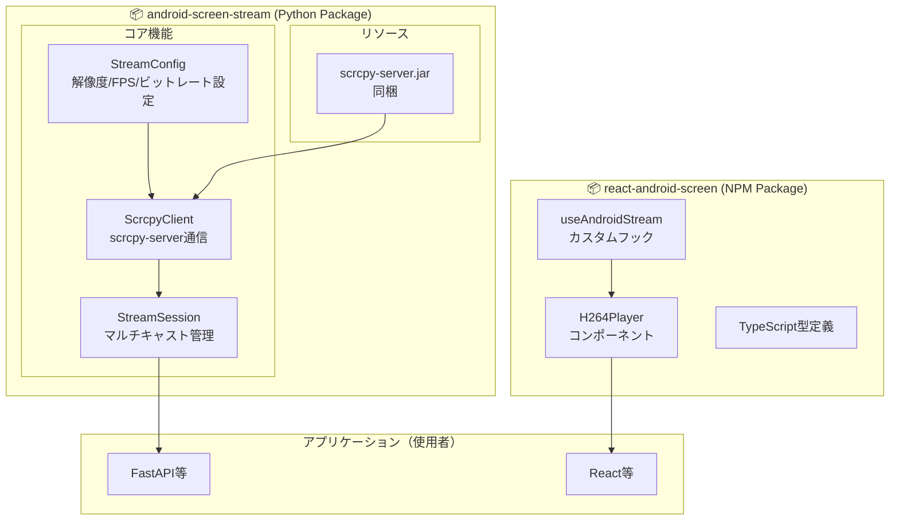
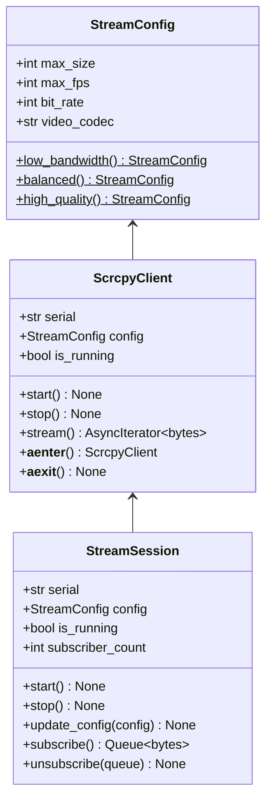
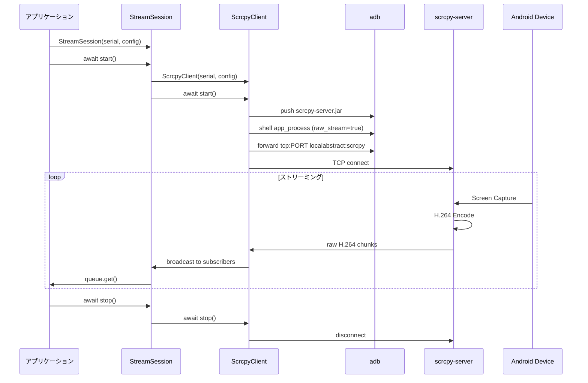

# android-screen-stream ライブラリ化計画書

作成日: 2026-01-25

## 目的

現在の screen-stream-capture プロジェクトから、再利用可能なライブラリを抽出し、他のプロジェクトで簡単に Android 画面ストリーミング機能を組み込めるようにする。

---

## アーキテクチャ

### 全体構成



### Python パッケージ詳細



### データフロー



---

## ディレクトリ構成

```
screen-stream-capture/
├── packages/
│   ├── android-screen-stream/          # Python パッケージ
│   │   ├── pyproject.toml
│   │   ├── README.md
│   │   └── src/
│   │       └── android_screen_stream/
│   │           ├── __init__.py         # 公開API
│   │           ├── config.py           # StreamConfig
│   │           ├── client.py           # ScrcpyClient
│   │           ├── session.py          # StreamSession
│   │           ├── adb.py              # ADB操作ユーティリティ
│   │           └── resources/
│   │               └── scrcpy-server.jar
│   │
│   └── react-android-screen/           # NPM パッケージ
│       ├── package.json
│       ├── tsconfig.json
│       ├── README.md
│       └── src/
│           ├── index.ts                # 公開API
│           ├── H264Player.tsx          # Reactコンポーネント
│           ├── useAndroidStream.ts     # カスタムフック
│           └── types.ts                # 型定義
│
├── examples/                           # 使用例
│   ├── simple-viewer/                  # 最小構成の例
│   │   ├── backend/
│   │   │   └── main.py
│   │   └── frontend/
│   │       └── App.tsx
│   └── multi-device/                   # 複数デバイス対応例
│
├── backend/                            # 現プロジェクトのバックエンド
├── frontend/                           # 現プロジェクトのフロントエンド
└── docs/
    ├── architecture.md
    └── api-reference.md
```

---

## 公開API設計

### Python パッケージ

```python
# android_screen_stream/__init__.py

from .config import StreamConfig
from .client import ScrcpyClient
from .session import StreamSession

__all__ = [
    "StreamConfig",
    "ScrcpyClient", 
    "StreamSession",
]
```

### 使用例

```python
# 例1: 低レベル（直接クライアント）
from android_screen_stream import ScrcpyClient, StreamConfig

config = StreamConfig(max_size=1080, max_fps=60, bit_rate=8_000_000)

async with ScrcpyClient("emulator-5554", config) as client:
    async for chunk in client.stream():
        process(chunk)


# 例2: セッション管理（マルチキャスト）
from android_screen_stream import StreamSession, StreamConfig

session = StreamSession("emulator-5554", StreamConfig.balanced())
await session.start()

queue = await session.subscribe()
try:
    while True:
        chunk = await queue.get()
        await websocket.send_bytes(chunk)
finally:
    await session.unsubscribe(queue)
    await session.stop()


# 例3: 設定の動的変更
await session.update_config(StreamConfig.high_quality())
```

### NPM パッケージ

```typescript
// 例1: コンポーネント
import { H264Player } from 'react-android-screen'

<H264Player
  wsUrl="/api/ws/stream/emulator-5554"
  className="w-full"
  onConnected={() => console.log('connected')}
  onError={(e) => console.error(e)}
/>

// 例2: カスタムフック
import { useAndroidStream } from 'react-android-screen'

const { videoRef, status, stats, connect, disconnect } = useAndroidStream({
  wsUrl: '/api/ws/stream/emulator-5554',
  autoConnect: true,
})

return <video ref={videoRef} autoPlay muted />
```

---

## 実装フェーズ

### Phase 1: Python パッケージ構造化 (1-2時間)

- [ ] `packages/android-screen-stream/` ディレクトリ作成
- [ ] `pyproject.toml` 作成（uv対応、editable install対応）
  ```toml
  [build-system]
  requires = ["hatchling"]
  build-backend = "hatchling.build"

  [project]
  name = "android-screen-stream"
  version = "0.1.0"
  requires-python = ">=3.11"

  [tool.hatch.build.targets.wheel]
  packages = ["src/android_screen_stream"]
  ```
- [ ] 既存コードを移動・リファクタリング
  - [ ] `scrcpy_client.py` → `client.py`
  - [ ] `h264_stream_session.py` → `session.py`
  - [ ] `ScrcpyConfig` → `config.py` に分離
- [ ] `__init__.py` で公開APIを定義
- [ ] `ScrcpyClient` に `server_jar` パラメータを必須化（同梱しない）

**インストール方法:**
```bash
# 他プロジェクトからの editable install
uv add --editable /path/to/packages/android-screen-stream

# または相対パス
uv add --editable ../packages/android-screen-stream
```

### Phase 2: StreamConfig 改善 (30分)

- [ ] プリセットメソッド追加（low_bandwidth, balanced, high_quality）
- [ ] バリデーション追加
- [ ] docstring 整備

### Phase 3: ScrcpyClient 改善 (1時間)

- [ ] コンテキストマネージャ対応（`async with`）
- [ ] 同梱 jar ファイルの自動検出
- [ ] エラーハンドリング強化
- [ ] ロギング整備

### Phase 4: StreamSession 改善 (1時間)

- [ ] `update_config()` メソッド追加（動的設定変更）
- [ ] 統計情報の充実
- [ ] グレースフルシャットダウン

### Phase 5: NPM パッケージ作成 (1-2時間)

- [ ] `packages/react-android-screen/` ディレクトリ作成
- [ ] `package.json`, `tsconfig.json` 設定
- [ ] 既存 `H264Player.tsx` を移動・リファクタリング
- [ ] `useAndroidStream` カスタムフック作成
- [ ] TypeScript型定義

### Phase 6: Docker Compose & Makefile (1-2時間)

- [ ] `docker-compose.yml` 新規作成
  - [ ] backend サービス（FastAPI + uvicorn）
  - [ ] frontend サービス（Vite dev server または nginx）
  - [ ] ボリュームマウント（editable install 対応）
- [ ] `Dockerfile` 作成
  - [ ] `examples/simple-viewer/backend/Dockerfile`
  - [ ] `examples/simple-viewer/frontend/Dockerfile`
- [ ] `Makefile` 新規作成（現在の Makefile は削除して置き換え）
  - [ ] `make setup` - 初期セットアップ（依存インストール、Docker ビルド、起動）
  - [ ] `make up` - Docker 起動
  - [ ] `make down` - Docker 終了
  - [ ] `make rebuild` - 完全再構築（イメージ削除、再ビルド、起動）
  - [ ] `make logs` - ログ表示
  - [ ] `make shell-backend` - バックエンドコンテナにシェル接続

**注意**: 現在の `Makefile` は `backend/` `frontend/` を直接参照しているため、ライブラリ化後は完全に新規作成となる。

### Phase 7: 使用例作成 (1時間)

- [ ] `examples/simple-viewer/` 最小構成例
- [ ] 現プロジェクトを examples 参照形式に変更

### Phase 8: ドキュメント整備 (1時間)

- [ ] ルート `README.md` 作成
  - [ ] プロジェクト概要
  - [ ] クイックスタート（`make setup`）
  - [ ] アーキテクチャ図
  - [ ] 使い方
- [ ] 各パッケージの README.md
- [ ] API リファレンス
- [ ] アーキテクチャドキュメント更新

#### README.md 構成案

```markdown
# screen-stream-capture

Android デバイスの画面をリアルタイムで Web ブラウザにストリーミングするライブラリ

## 特徴

- 🚀 低遅延 H.264 ストリーミング
- 📱 複数デバイス同時対応
- 🔧 解像度・FPS・ビットレート設定可能
- 🐳 Docker Compose で簡単起動

## クイックスタート

### 前提条件

- Docker & Docker Compose
- Android デバイス（USB接続 or エミュレータ）
- adb（Android Debug Bridge）

### セットアップ

\```bash
git clone https://github.com/your/screen-stream-capture.git
cd screen-stream-capture

# 初期セットアップ（依存インストール + Docker ビルド + 起動）
make setup
\```

ブラウザで http://localhost:5173 にアクセス

### コマンド一覧

| コマンド | 説明 |
|---------|------|
| `make setup` | 初期セットアップ |
| `make up` | Docker 起動 |
| `make down` | Docker 終了 |
| `make rebuild` | 完全再構築 |
| `make logs` | ログ表示 |

## アーキテクチャ

\```mermaid
graph LR
    Android[Android Device] -->|H.264| Backend[FastAPI]
    Backend -->|WebSocket| Browser[Browser]
    Browser -->|JMuxer| Video[Video Playback]
\```

## ライブラリとして使う

### Python (Backend)

\```bash
uv add --editable /path/to/packages/android-screen-stream
\```

\```python
from android_screen_stream import StreamSession, StreamConfig

session = StreamSession("emulator-5554", StreamConfig.balanced())
await session.start()

queue = await session.subscribe()
async for chunk in queue:
    await websocket.send_bytes(chunk)
\```

### React (Frontend)

\```bash
npm install /path/to/packages/react-android-screen
\```

\```tsx
import { H264Player } from 'react-android-screen'

<H264Player wsUrl="/api/ws/stream/emulator-5554" />
\```

## ライセンス

MIT
```

### Phase 9: クリーンアップ (30分)

- [ ] 現在の `backend/` ディレクトリを削除
- [ ] 現在の `frontend/` ディレクトリを削除
- [ ] ルートの `README.md` を更新（ライブラリとしての説明に変更）
- [ ] `Makefile` を更新（examples 用に変更）
- [ ] 不要になったファイルの削除
  - [ ] `scripts/` の一時スクリプト
  - [ ] `work/` の古い作業ファイル

---

## 最終ディレクトリ構成

```
screen-stream-capture/
├── packages/
│   ├── android-screen-stream/     # Python ライブラリ
│   │   ├── pyproject.toml
│   │   ├── README.md
│   │   └── src/
│   │       └── android_screen_stream/
│   │           ├── __init__.py
│   │           ├── config.py
│   │           ├── client.py
│   │           └── session.py
│   │
│   └── react-android-screen/      # NPM ライブラリ
│       ├── package.json
│       ├── README.md
│       └── src/
│           ├── index.ts
│           ├── H264Player.tsx
│           ├── useAndroidStream.ts
│           └── types.ts
│
├── vendor/                        # 外部依存（make setup でダウンロード）
│   └── scrcpy-server.jar          # GitHub Releases から取得
│
├── examples/
│   └── simple-viewer/             # 最小構成の使用例
│       ├── docker-compose.yml     # Docker Compose 設定
│       ├── backend/
│       │   ├── Dockerfile
│       │   ├── pyproject.toml     # android-screen-stream に依存
│       │   └── main.py
│       └── frontend/
│           ├── Dockerfile
│           ├── package.json       # react-android-screen に依存
│           └── src/App.tsx
│
├── docker-compose.yml             # ルート Docker Compose（examples を参照）
├── Makefile                       # make setup / down / rebuild
├── docs/                          # ドキュメント
├── README.md                      # プロジェクト説明
└── LICENSE
```

---

## Makefile コマンド一覧

| コマンド | 説明 |
|---------|------|
| `make setup` | 初期セットアップ（依存インストール + Docker ビルド + 起動） |
| `make up` | Docker コンテナ起動 |
| `make down` | Docker コンテナ終了 |
| `make rebuild` | 完全再構築（イメージ削除 + 再ビルド + 起動） |
| `make logs` | ログ表示 |
| `make shell-backend` | バックエンドコンテナにシェル接続 |

### Makefile 実装イメージ

```makefile
.PHONY: setup up down rebuild logs shell-backend download-scrcpy-server

# scrcpy-server のバージョン
SCRCPY_VERSION := 3.3.4
SCRCPY_SERVER_URL := https://github.com/Genymobile/scrcpy/releases/download/v$(SCRCPY_VERSION)/scrcpy-server-v$(SCRCPY_VERSION)
SCRCPY_SERVER_PATH := vendor/scrcpy-server.jar

# scrcpy-server ダウンロード
download-scrcpy-server:
	@mkdir -p vendor
	@if [ ! -f $(SCRCPY_SERVER_PATH) ]; then \
		echo "=== Downloading scrcpy-server v$(SCRCPY_VERSION) ==="; \
		curl -L -o $(SCRCPY_SERVER_PATH) $(SCRCPY_SERVER_URL); \
	else \
		echo "=== scrcpy-server already exists ==="; \
	fi

# 初期セットアップ
setup: download-scrcpy-server
	@echo "=== Installing dependencies ==="
	cd packages/android-screen-stream && uv sync
	cd examples/simple-viewer/frontend && npm install
	@echo "=== Building Docker images ==="
	docker compose build
	@echo "=== Starting containers ==="
	docker compose up -d
	@echo "=== Setup complete ==="
	@echo "Backend: http://localhost:8000"
	@echo "Frontend: http://localhost:5173"

# Docker 起動
up:
	docker compose up -d

# Docker 終了
down:
	docker compose down

# 完全再構築
rebuild:
	docker compose down --rmi all --volumes --remove-orphans
	docker compose build --no-cache
	docker compose up -d

# ログ表示
logs:
	docker compose logs -f

# バックエンドシェル
shell-backend:
	docker compose exec backend /bin/bash
```

---

## Docker Compose 構成

```yaml
# docker-compose.yml
services:
  backend:
    build:
      context: .
      dockerfile: examples/simple-viewer/backend/Dockerfile
    ports:
      - "8000:8000"
    volumes:
      # editable install のためソースをマウント
      - ./packages/android-screen-stream:/app/packages/android-screen-stream:ro
      - ./examples/simple-viewer/backend:/app/backend
    environment:
      - ADB_SERVER_HOST=host.docker.internal  # ホストの adb server を使用
    extra_hosts:
      - "host.docker.internal:host-gateway"

  frontend:
    build:
      context: .
      dockerfile: examples/simple-viewer/frontend/Dockerfile
    ports:
      - "5173:5173"
    volumes:
      - ./packages/react-android-screen:/app/packages/react-android-screen:ro
      - ./examples/simple-viewer/frontend:/app/frontend
    depends_on:
      - backend
```

---

| 成果物 | 説明 |
|--------|------|
| `packages/android-screen-stream/` | Python パッケージ（pip/uv でインストール可能） |
| `packages/react-android-screen/` | NPM パッケージ（npm でインストール可能） |
| `examples/` | 使用例 |
| `docs/api-reference.md` | API リファレンス |

---

## 技術的考慮事項

### scrcpy-server.jar の配布

```python
# パッケージ内のリソースパスを取得
import importlib.resources

def get_server_jar_path() -> str:
    """同梱されている scrcpy-server.jar のパスを取得"""
    with importlib.resources.path(
        "android_screen_stream.resources", 
        "scrcpy-server.jar"
    ) as path:
        return str(path)
```

### 依存関係

**Python パッケージ:**
- なし（標準ライブラリのみ）
- adb は外部コマンドとして必要

**NPM パッケージ:**
- `jmuxer` - H.264 → MSE 変換
- `react` (peerDependency)

---

## 次のアクション

1. この計画書のレビュー・承認
2. Phase 1 から順次実装開始
