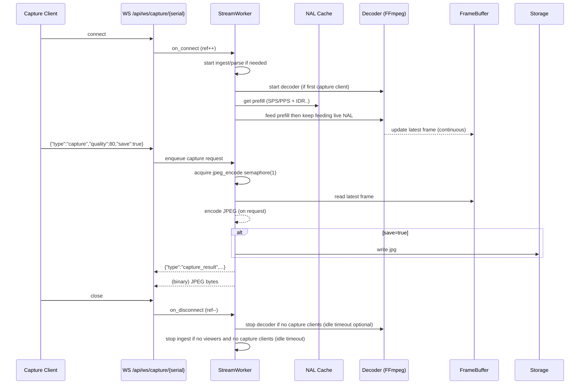

# 開発計画: マルチデバイス配信 + サーバー側JPEGキャプチャ（2026-01-26）

## 目的（2つのTODOを同時に満たす）

1) **複数デバイスのスクリーンを同時に、複数クライアントへ配信可能**にする（アーキテクチャから見直し）
2) **クライアント操作（ボタン押下）をトリガーに、任意タイミングの画面を JPEG としてサーバー側で保存**できるようにする
   - 視聴（配信受信）していない状態でもキャプチャが取れる
   - キャプチャ処理が配信レイテンシに悪影響を与えない（配信遅れなし）

本計画は、現状の構成（FastAPI + `android-screen-stream` の `StreamManager/StreamSession` + WS配信 + late join 対策）をベースに、**「デバイスごとの配信ワーカー（Stream Worker）」を中核に置く設計**へ拡張する。

---

## 現状整理（前提）

- H.264 は scrcpy の `raw_stream=true` で受け取り、サーバー側で AnnexB を NAL 単位に再構成している（late join を安定化済み）
- バックエンドは `app.state.stream_manager` によりデバイス別セッションを管理し、WS `/api/ws/stream/{serial}` で配信している
- ただし「配信管理（起動/停止/購読/複数デバイス）」と「キャプチャ（デコード + JPEG化）」が一体設計になっていない

---

## 要件（詳細）

### 機能要件

- **マルチデバイス × マルチクライアント**
  - 同一デバイスを複数クライアントへ同時配信（既存機構を継続）
  - 複数デバイスを同時に配信（APIとライフサイクルを明確化）
  - クライアントは複数WSを張れる/または1WSで多重化できる（後述）

- **キャプチャ（JPEG保存）**
  - `POST` 等でトリガーし、サーバーで JPEG を保存
  - 保存された画像のメタデータ（timestamp, serial, size等）を返す
  - 配信視聴がゼロでもキャプチャ可能（= ストリームが無いなら開始して最低1フレームが得られるまで待つ）
  - 配信処理をブロックしない（キャプチャは別経路で“読み取り専用”にタップする）

### 非機能要件（目標値）

- キャプチャの追加遅延目安: **5〜30ms**（案の前提）
  - 重要: 「配信に追加遅延を入れない」ことが本質。キャプチャは別タスク/別キューで落ちても良い。
- メモリ上限: デバイスごとに **フレームは基本1枚（latest-only）** を保持
- バックプレッシャ: 配信経路/デコード経路ともに **drop 戦略**を採用（遅い処理が全体を止めない）

---

## アーキテクチャ案（統合）

### コア方針

- デバイスごとに **Stream Worker** を作り、以下を1ユニットとして管理する
  - scrcpy 入力（H.264 AnnexB/NAL）
  - 配信ブロードキャスト（WSへ送るための購読管理）
  - H.264 ingest/parse（NAL再構成 + SPS/PPS/GOPキャッシュ）
  - キャプチャ要求の調停（多重起動防止・ジョブ管理）

- 配信経路とキャプチャ経路は **同じ H.264 “ソース”を共有**するが、
  - 配信は NAL をそのまま
  - キャプチャは要求時にだけ「復号→JPEG生成」を走らせる
  - **相互にブロックしない**よう、WS配信タスクとキャプチャジョブを分離する

### 全体像（Mermaid）

```mermaid
graph TB
  subgraph Android[Android Device]
    SC[scrcpy-server\nH.264 encode]
  end

  subgraph Backend[Backend (FastAPI)]
    DM[DeviceManager\nadb track-devices]
    SSE[SSE /api/events]

    SM[StreamManager]
    WA[StreamWorker(A)]
    WB[StreamWorker(B)]

    NA[NAL Cache\nSPS/PPS + latest GOP]
    NB[NAL Cache\nSPS/PPS + latest GOP]

    WSsA[WS /api/ws/stream/A\n(raw H.264 NAL)]
    WSsB[WS /api/ws/stream/B\n(raw H.264 NAL)]

    WScA[WS /api/ws/capture/A]
    WScB[WS /api/ws/capture/B]

    DEC[Decoder\nFFmpeg H.264 decode]
    FB[FrameBuffer\nlatest-only raw/YUV]
    ENC[JPEG Encode\n(on request)]
    STORE[(JPEG Storage)]
  end

  subgraph Clients[Clients]
    V1[Viewer Client]
    V2[Viewer Client]
    Cap1[Capture Client]
    Cap2[Capture Client]
  end

  DM --> SSE
  V1 -->|listen| SSE

  SC -->|raw H.264| WA
  SC -->|raw H.264| WB

  WA --> NA
  WB --> NB

  WA --> WSsA
  WB --> WSsB

  V1 -->|connect| WSsA
  V2 -->|connect| WSsA
  V1 -->|connect| WSsB

  Cap1 -->|connect| WScA
  Cap2 -->|connect| WScA

  NA --> DEC
  WScA -->|while connected| DEC
  DEC --> FB

  WScA -->|capture request| ENC
  FB --> ENC
  ENC -->|JPEG bytes| WScA
  ENC --> STORE
```

### キャプチャのシーケンス（Mermaid）



---

## API設計（変更/追加案）

### API一覧（案A + capture WS）

| 種別 | パス | 用途 | 備考 |
|------|------|------|------|
| HTTP | `GET /healthz` | ヘルスチェック | 既存 |
| HTTP | `GET /api/devices` | デバイス一覧 | 既存 |
| HTTP | `GET /api/devices/{serial}` | デバイス詳細 | 既存 |
| SSE | `GET /api/events` | デバイス変更通知 | 既存 |
| HTTP | `GET /api/sessions` | 稼働セッション一覧 | 既存/整備 |
| WS | `WS /api/ws/stream/{serial}` | 動画視聴用 raw H.264 NAL配信 | 既存 |
| WS | `WS /api/ws/capture/{serial}` | キャプチャ要求→JPEG bytes返却 | 新規 |

### 1) 配信（WS）

現状の **デバイス別WS** を継続し、クライアントが必要なデバイス分だけWSを開く方式を第一候補にする。

- 長所: 実装が単純、ブラウザの既存プレイヤー（JMuxer）と相性が良い
- 短所: 同時デバイス数が増えるとWS本数が増える

案A（現状踏襲）:
- `GET /api/devices`（既存）
- `WS /api/ws/stream/{serial}`（既存）
- `GET /api/sessions`（既存/整備）

将来案B（多重化）:
- `WS /api/ws/stream` にして、
  - text: subscribe/unsubscribe メッセージ
  - binary: `(serial, payload)` のフレーミング
  - ※JMuxer側で demux が必要、フロント変更が大きい

本計画では、アーキテクチャ更新の影響を抑えつつ確実に価値を出すため、**案Aで進める**。

### 2) キャプチャ（新規・アーキテクチャ変更）

要件の「デバイスごとに常時（重い）デコードを走らせない」を優先し、
キャプチャは **キャプチャ専用 WebSocket** を張っている間だけ H.264 デコードを常駐させる。

本計画では用語を明確化する:
- **H.264 ingest/parse**: scrcpy から H.264 を受信し、AnnexB→NAL再構成と SPS/PPS+GOPキャッシュを更新する（軽量）
- **H.264 decode**: 画像生成のために H.264 を継続的に復号し、最新フレームを保持する（重い・WS接続中のみ）
- **JPEG encode**: 最新フレームをJPEG化してバイナリとして返す（要求時のみ）

#### 推奨（キャプチャ専用WS）

- `WS /api/ws/capture/{serial}`
  - 接続: キャプチャが欲しいクライアントだけが接続（動画視聴は不要）
  - 要求: クライアントが任意タイミングで `capture` を送る（同一WSで何度でも）
  - 応答: サーバーが JPEG を生成し、**JPEGバイナリ（そのままファイル保存可能）** を返す
  - ライフサイクル:
    - WS接続中: 該当デバイスの **H.264 ingest/parse** を稼働（必要ならscrcpy起動）
    - WS接続中: 併せて **FFmpeg等でH.264 decode** を常駐し、FrameBuffer（latest-only）を更新
    - `capture` 要求時: **JPEG encode のみ**実行し、FrameBufferの最新フレームをJPEG化して返す
  - 多重化: serial単位で接続を集約し、**デバイスにつきデコーダは1つ**（複数クライアントは同じデコーダ/FrameBufferを共有）

プロトコル案（最小）:
- client → server (text JSON): `{"type":"capture","format":"jpeg","quality":80,"save":true}`
- server → client (text JSON): `{"type":"capture_result","capture_id":"...","captured_at":"...","width":...,"height":...,"path":"...","bytes":...}`
- server → client (binary): **JPEG bytes**

エラー時（例）:
- server → client (text JSON): `{"type":"error","code":"CAPTURE_TIMEOUT","message":"..."}`

タイムアウト指針（例）:
- `capture` 受付から **2〜5秒** を上限に、初回のデコード済みフレームが得られなければ timeout

バイナリ送信の紐付け:
- `capture_result` を先に返し、直後の binary を同一 `capture_id` のJPEGとして扱う（実装が簡単）

#### 互換・簡易（REST）

REST でのワンショットが欲しい場合は併設できる（内部的に同じ capture 実装を呼ぶ）：
- `POST /api/devices/{serial}/capture`

ただし「デコードはWS接続中だけ」という運用ルールを明確にするなら、まずは WS のみに絞るのが分かりやすい。

---

## 「raw H.264 から自由なタイミングで JPG 切り出し」調査結果（設計に組み込む）

### 基本結論

- raw H.264 は **任意の瞬間に“その場で”JPEGへ直接変換**できない（フレーム復号が必要）
- 任意タイミングのキャプチャを“低遅延”で実現するには、以下のどちらかが必要
  1) **常駐デコード**して最新フレームを保持（推奨）
  2) トリガー時にデコードを開始（初回はIDR待ち/デコード準備で遅延が大きい）

要件「配信を受けてなくてもキャプチャ可」「配信遅れなし」を同時に満たすには、
**(1) 常駐デコード + latest-only フレームバッファ**が最も素直。

### 実装案: 「接続中だけ」FFmpeg常駐“デコードだけ”

要件に合わせ、FFmpeg は **キャプチャ用WSが張られている間だけ** 起動してH.264デコードを継続する。

- `WS /api/ws/capture/{serial}` 接続中
  - H.264 ingest/parse を稼働し、SPS/PPS + 最新GOPキャッシュを更新
  - FFmpeg を起動して H.264 を継続的に復号し、FrameBuffer（latest-only）を更新
- `capture` 要求時
  - FrameBuffer の最新フレームを JPEG encode して、JPEG bytes をWSで返す（必要なら保存）

多重起動回避（同一serial）:
- デバイスごとに「capture WS接続数」を参照カウントし、0→1でFFmpeg起動、1→0で停止
- JPEG encode は `asyncio.Semaphore(1)` 等で **直列化**（CPUスパイクと保存競合を抑える）

ポイント:
- 最短で要件を満たすには「FFmpegでJPEG bytesを直接生成」が実装しやすい
- 将来最適化として、FFmpegの出力を `yuv420p` にして turbojpeg の **YUV直圧縮**へ寄せる余地がある
- “遅い処理”が配信を止めないよう、captureジョブは別タスクで実行し、ジョブが詰まったら待たせる/落とす方針を明確にする

成立条件（重要）:
- H.264 デコードには SPS/PPS + IDR が必要
- 既存の late join 対策（SPS/PPS + 最新GOPキャッシュ）があるため、
  - キャプチャWS接続時に **prefill（SPS→PPS→IDR〜）** をデコーダへ投入し、初期化を最短化する
  - 以降はライブ入力を継続して FrameBuffer を更新し続ける

代替案（比較のため）:
- **FFmpegでMJPEGをimage2pipeで吐く**: Python側のエンコード負荷は減るが、pipe上のJPEGフレーミングが必要/FFmpegが常にencodeするのでCPU増
- **PyAV（libavcodec）でin-process**: プロセス管理は簡単になるが、依存関係/配布が重くなりやすい

この計画では「導入の確実性」と「観測容易性」を優先し、
**キャプチャWS接続中だけFFmpegデコード常駐 + 要求時にturbojpegでJPEGエンコード** を第一候補とする。

---

## 実装方針（段階的）

### Phase 0: 設計確定（1日）

- [ ] API（streamは案A、captureはWS追加、RESTは任意）の確定
- [ ] Stream Worker の責務とライフサイクル定義（開始条件/停止条件/アイドルタイムアウト）
- [ ] 設定項目の追加案
  - `capture_dir`
  - `capture_jpeg_quality`
  - `stream_idle_timeout_sec`
  - `decoder_enabled`（将来の切り替え用）

完了条件:
- 本ファイルの内容が「実装に着手できるレベル」で合意される

### Phase 1: 配信管理の再整理（2日）

狙い: 「複数デバイス×複数クライアント」を**運用可能な形で**成立させる（＝資源管理と可観測性を整える）。

- [ ] `StreamManager`（バックエンド側）に “DeviceWorkerRegistry” 相当を導入
  - `get_or_create_worker(serial)`
  - `stop_worker(serial)` / `stop_all()`
- [ ] セッション起動/停止条件
  - WS購読が1つでもあれば起動
  - （キャプチャで必要になれば起動）
  - どちらも無ければ idle timeout で停止
- [ ] メトリクス/状態（OpenAPI response_modelで公開）
  - 接続クライアント数
  - 受信bps/送信bps
  - decoder稼働状況

完了条件:
- 2台以上のデバイスを同時にWSで視聴できる
- クライアント0になったら一定時間でプロセスが止まる（残留しない）

### Phase 2: キャプチャWS接続中だけデコード常駐 + 要求時JPEG返却（2〜3日）

- [ ] Decoder（FFmpeg）管理
  - serialごとに 0→1 接続で起動、1→0 で停止（短い idle timeout は任意）
  - 入力: AnnexB（prefill + ライブ）
  - 出力: rawvideo（yuv420p 推奨）
- [ ] FrameBuffer（latest-only）
  - `timestamp` + `pixel_format` + `bytes` + `width/height`
  - 更新は常時、読み出しは `capture` 時のみ
- [ ] JPEGエンコード（要求時のみ）
  - `capture` 要求ごとに FrameBuffer をJPEG化してWS binaryで返す
  - 同一serialの同時要求は `asyncio.Semaphore(1)` で直列化

完了条件:
- キャプチャWSを張ったまま `capture` を複数回送っても都度JPEG bytesが返る
- 同一serialに複数クライアントが接続してもデコーダは1つ

### Phase 3: Capture WebSocket API（1〜2日）

- [ ] `WS /api/ws/capture/{serial}` を追加（OpenAPI上はWebSocketは自動ドキュメントが弱いので、endpoint description と docs を併用）
- [ ] serial単位の接続管理
  - 同一serialに複数クライアントが接続しても、captureジョブは **直列化**（FFmpeg多重起動を防ぐ）
- [ ] `capture` メッセージで JPEG bytes を生成して返す
  - まずは FFmpeg で JPEG bytes を直接生成（最短）
  - 将来最適化: turbojpeg（YUV直圧縮）でCPU削減
  - 保存先とファイル命名
- [ ] “視聴ゼロでもキャプチャ可” のための起動動作
  - workerが無ければ起動
  - デコーダ初期化（prefill）後、FrameBufferが未準備なら一定時間待つ（timeout返却）

完了条件:
- 視聴していない状態でも `capture` を叩けばJPEGが保存される
- キャプチャ連打しても配信が遅延/停止しない

### Phase 4: テスト/可観測性/ドキュメント（1〜2日）

- [ ] ユニットテスト
  - FrameBuffer の同時アクセス
  - capture命名規則
  - デコーダのdrop戦略（キュー溢れでも落ちない）
- [ ] 統合テスト（任意/環境依存）
  - FFmpegがある環境での “1フレーム生成”
- [ ] docs更新
  - `docs/architecture.md` に Stream Worker と capture の図を追加
  - `docs/backend-openapi.md` に capture endpoint の説明

完了条件:
- `pytest` が通る
- `/docs` に新APIが表示される

---

## リスクと対策

- **解像度の取得**
  - リスク: raw_stream ではメタヘッダが無いので、デコード出力サイズが確定しづらい
  - 対策: SPS解析で width/height を取得（推奨）、もしくは scrcpy 側設定で固定に寄せる

- **FFmpeg常駐プロセス管理**
  - リスク: プロセス残留/詰まり
  - 対策: idle timeout、stdin/stdout drain、例外時の確実なkill、lifespanでstop_all

- **CPU負荷**
  - リスク: デバイス数×デコードで負荷増
  - 対策: decoderは必要なデバイスだけ有効化、fpsやmax_sizeのデフォルトを抑える、drop前提

- **キャプチャ時の配信遅延**
  - リスク: エンコードが配信タスクをブロック
  - 対策: キャプチャは別タスク、FrameBufferコピーだけを短時間ロック、I/O（保存）も別スレッド/タスク

---

## 次アクション（合意事項）

- この計画のうち、以下を先に確定したい
  - WSは「デバイス別WS（案A）」で進める
  - captureは **`WS /api/ws/capture/{serial}`**（要求時にJPEG生成、接続中だけデコード）
  - ingest/parse は「WS接続中だけ」稼働、decode+JPEG は「capture要求時だけ」稼働

合意後、Phase 1 から実装を開始する。
